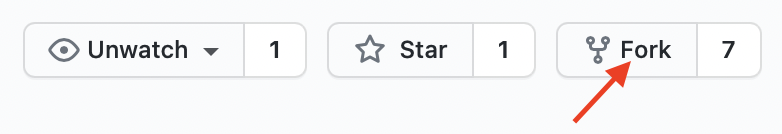
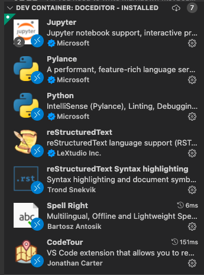
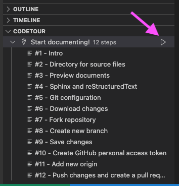

# Belgeler

Bu depo [TRUBA Belge Sunucusu](http://docs.truba.gov.tr)'nda kullanılan belgeleri içermektedir.

## Belgelere katkıda bulunma

Belgelere katkıda bulunmadan önce lütfen TRUBA ekibiyle iletişime geçiniz: ncc@ulakbim.gov.tr

Belgelere katkıda bulunmak için bu depoyu çatalladıktan sonra yeni dalda çalışmanız gerekmektedir:



```
git clone https://github.com/[YOUR_USERNAME]/Belgeler.git truba-belgeler # Çatalladığınız depoyu bilgisayarınıza klonlayın.
cd truba-belgeler
git checkout -b [NEW_BRANCH] # Yeni dal yaratın
```

Değişiklikleri yaptıktan sonra:

```
git add --all
git commit -m "information about this commit"
git push origin [NEW_BRANCH]
```

Yaptığınız tüm değişiklikleri GitHub'a ittikten sonra TRUBA ekibine GitHub üzerinden çekme isteği (pull request) gönderebilirsiniz.

### VSCode ve Remote Containers eklentisini kullanarak Docker imajı ile çalışma

Bu depoda belgelere katkıda bulunmayı VSCode kullanarak kolaylaştırmak için şu dosyalar bulunmaktadır:
- .devcontainer/devcontainer.json
- .tours/start-documenting.json

Hazırlık: VSCode'da Docker Container içerisinde geliştirme yapmak için [ilgili belgeyi](https://code.visualstudio.com/docs/remote/containers) takip edebilirsiniz.

Hazırlığı tamamladıktan sonra klonladığınız depoyu bilgisayarınızda açmak için VSCode `F1`&rarr;`Remote-Containers: Open folder in container...` komutunu kullanabilirsiniz.

Klasör VSCode'da Docker container içinde açıldıktan sonra eklentiler menüsünden önerilen eklentileri etkinleştirmeniz gerekmektedir:



CodeTour eklentisini etkinleştirdikten sonra hazırladığımız "Start documenting!" turunu kullanarak katkıda bulunmaya hızlıca başlayabilirsiniz.



## Belgeleme sistemi hakkında genel bilgi

[TRUBA Kullanıcı Dökümanları'nda](https://docs.truba.gov.tr) bulunan başlıklar [dört ana kategoride](https://diataxis.fr/) toplanmıştır:
- Referans materyalleri (TRUBA Hakkında ve EuroHPC Hakkında)
- Nasıl yapılır kılavuzları (Uygulama Kılavuzları)
- Detaylı açıklamalar (Eğitim Materyalleri)
- Öğretici başlangıç materyalleri

Başlıklar altında bulunan belgelere katkıda bulunmadan önce [kullanılan belgeleme sistemini](https://www.youtube.com/watch?v=t4vKPhjcMZg) inceleyerek kategorilerin özelliklerine göre içerik üretmek tutarlılığın bozulmasını engellemek için önemlidir.

## HTML sayfalarının derlenmesi

Bilgisayarınızda Docker kuruluysa HTML sayfalarını derlemek için şu komutları kullanabilirsiniz:
- ``docker run`` ile başlayan komutta ``/path/to/truba-belgeler`` ve ``/path/to/build`` patikalarını güncellemeyi unutmayın.

```
mkdir build
git clone https://github.com/TRUBA-HPC/Belgeler.git truba-belgeler
docker run --rm -v /path/to/truba-belgeler:/docs -v /path/to/build:/build docker pull trubahpc/tabula_machina:latest /bin/bash -c "source /opt/sphinx/bin/activate && sphinx-build -b html /docs/source /build"
```

Derlenen dosyaları ``build`` klasöründe bulabilirsiniz.

``main`` yerine başka bir dal klonlamak için aşağıdaki komutu kullanabilirsiniz:

```
git clone -b [BRANCH_NAME] https://github.com/TRUBA-HPC/Belgeler.git truba-belgeler
```

## Lisans hakkında bilgi

EuroCC@Türkiye projesi kapsamında sunulan tüm materyaller, [Creative Commons Atıf lisansı (CC-BY-NC-SA-4.0)](https://creativecommons.org/licenses/by-nc-sa/4.0/) altında sağlanır. 
