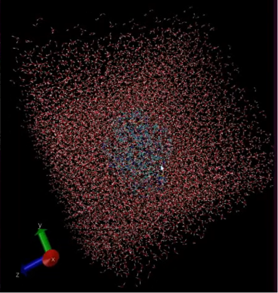
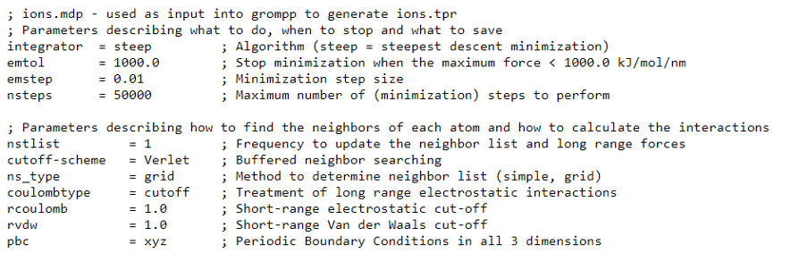
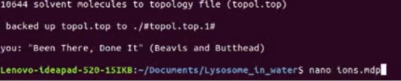
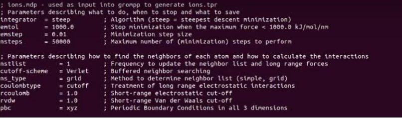

=================================
Başlangıç Yapısının Hazırlanması
=================================

-------------------------------------
Protein İçin Topoloji Oluşturulması
-------------------------------------

İlk komut;

.. code-block::

    grep -v HOH 1aki.pdb > 1AKI_clean.pdb

Bu komutla `pdb` deki fazla su molekülleri uzaklaştırılır ve proteini kullanıma hazır hale getirir ve size ``1AKI_clean.pdb`` şeklinde bir çıktı verir. Bu örnekte suyun uzaklaştırılması gerektiği için bu adım yapılmıştır, sizin proteininizde buna ihtiyaç yoksa bu adımı atlayabilirsiniz. Bir sonraki adımda ise protein işlenir:

.. code-block::

    gmx pdb2gmx -f 1AKI_clean.pdb -o 1AKI_processed.gro -water spce

Bu komutta ``pdb2gmx`` işlenecek olan kodu -ki ``pdb2gmx`` komutu kuvvet alanı uyumlu topoloji dosyası oluşturan komuttur.- ``-f 1AKI_clean.pdb`` sizin işlemek üzere seçtiğiniz dosyayı, ``-o 1AKI_processed.gro`` kısmı ise çıktı dosyanızı gösterir. GROMACS'ta kullanılan dosyalar ``.gro`` uzantısına sahip olmak zorunda değildir. Fakat ``.gro`` uzantısı koordinatları içeren dosyaların varsayılan formatıdır. Çok kompakt bir formattır ancak hassasiyeti sınırlıdır. Örneğin, `PDB` biçimini kullanmayı tercih ederseniz tek yapmanız gereken çıktı olarak ``.pdb`` uzantılı uygun bir dosya adı belirlemektir.
Ekranda şu şekilde kuvvet alanı seçmenizi isteyen bir listeyle karşılaşacaksınız. Kuvvet alanı, topolojideki bilgileri belirler, bu nedenle kullanmak istediğiniz özelliklere uygun bir kuvvet alanı seçmelisiniz. Kullanmak istediğiniz kuvvet alanının numarasını girebilirsiniz, bu örnekte biz OPLS kullanacağız. Yani 15 yazıp ``Enter`` a basıp devam edin.

.. code-block::

    Select the Force Field:
    From '/usr/local/gromacs/share/gromacs/top':
    1: AMBER03 protein, nucleic AMBER94 (Duan et al., J. Comp. Chem. 24, 1999-2012, 2003)
    2: AMBER94 force field (Cornell et al., JACS 117, 5179-5197, 1995)
    3: AMBER96 protein, nucleic AMBER94 (Kollman et al., Acc. Chem. Res. 29, 461-469, 1996)
    4: AMBER99 protein, nucleic AMBER94 (Wang et al., J. Comp. Chem. 21, 1049-1074, 2000)
    5: AMBER99SB protein, nucleic AMBER94 (Hornak et al., Proteins 65, 712-725, 2006)
    6: AMBER99SB-ILDN protein, nucleic AMBER94 (Lindorff-Larsen et al., Proteins 78, 1950-58, 2010)
    7: AMBERGS force field (Garcia & Sanbonmatsu, PNAS 99, 2782-2787, 2002)
    8: CHARMM27 all-atom force field (CHARM22 plus CMAP for proteins)
    9: GROMOS96 43a1 force field
    10: GROMOS96 43a2 force field (improved alkane dihedrals)
    11: GROMOS96 45a3 force field (Schuler JCC 2001 22 1205)
    12: GROMOS96 53a5 force field (JCC 2004 vol 25 pag 1656)
    13: GROMOS96 53a6 force field (JCC 2004 vol 25 pag 1656)
    14: GROMOS96 54a7 force field (Eur. Biophys. J. (2011), 40,, 843-856, DOI: 10.1007/s00249-011-0700-9)
    15: OPLS-AA/L all-atom force field (2001 aminoacid dihedrals)

Çıktı olarak dosyanızda ``1AKI_processed.gro``, ``posre.itp`` ve ``topol.top`` dosyaları oluşacaktır. ``posre.itp`` konum dosyası, ``topol.top`` ise topoloji dosyasıdır. 

.. note::

    * Eğer topoloji dosyanızda proteininizdeki H atomlarının olmasını istemiyorsanız ``-ignh`` komutunu ``pdb2gmx`` komutunun yanına ekleyerek kullanınız.
    * Eğer N ve C atomları için yük belirlemek istiyorsanız ``-ter`` komutunu ``pdb2gmx`` komutunun yanına ekleyerek kullanınız.
    * Eğer Glu, Asp, Lys, Arg ve His için yük belirlemek istiyorsanız ``-inter`` komutunu ``pdb2gmx`` komutunun yanına ekleyerek kullanınız.

.. figure:: /assets/compmatscience-gromacs-education/gmx_topology.png
   :align: center
   :width: 300px
   
   Topoloji dosyası

Topoloji dosyasında proteindeki atomların konumlarını ve yüklerini görebilirsiniz. Oldukça önemli bir dosyadır. 

.. code-block::

    ; Name       nrexcl
    Protein_A    3

Protein, PDB dosyasında zincir A olarak geçtiğinden dolayı ``Protein A`` olarak adlandırılmıştır. Bağ komşuları için 3 istisna vardır. Bu istisnalarla ilgili daha detaylı bilgi GROMACS el kitabında bulunabilir. 

.. code-block::

    [ atoms ]
    ;   nr       type  resnr residue  atom   cgnr     charge       mass  typeB    chargeB      massB
    ; residue   1 LYS rtp LYSH q +2.0
     1   opls_287      1   LYS       N      1       -0.3    14.0067   ; qtot -0.3
     2   opls_290      1   LYS      H1      1       0.33      1.008   ; qtot 0.03
     3   opls_290      1   LYS      H2      1       0.33      1.008   ; qtot 0.36
     4   opls_290      1   LYS      H3      1       0.33      1.008   ; qtot 0.69
     5  opls_293B      1   LYS      CA      1       0.25     12.011   ; qtot 0.94
     6   opls_140      1   LYS      HA      1       0.06      1.008   ; qtot 1

Bu tabloda,

* nr: Atom sayısı

* type: Atom tipi

* resnr: Amino asit kalıntı numarası

* residue: Amino asit kalıntı adı (Bu kalıntının PDB dosyasında ``LYS`` olduğuna dikkat edin.)

* atom name: atom adı

* cgnr: Yük grup numarası (Yük grupları, tamsayı yük gruplarını tanımlar.)

* charge: Yük (``qtot`` moleküle etki eden toplam yüktür.)

* mass: kütle

* typeB, chargeB, massB: Serbest enerjideki değişimler için kullanılır.

Topolojiye su molekülü eklemek içinse ``pdb2gmx`` komutuna ``-water spce`` komutu eklenir. Topoloji dosyasında şu şekilde görünmektedir:

.. code-block::

    ; Include water topology
    #include "oplsaa.ff/spce.itp"

    #ifdef POSRES_WATER
    ; Position restraint for each water oxygen
    [ position_restraints ]
    ;  i funct       fcx        fcy        fcz
        1    1       1000       1000       1000
    #endif

Ayrıca görselde görüldüğü üzere suyun konumu 1000 kj mol :sup:`-1` nm :sup:`-2` gibi kuvvet sabiti (kpr) kullanılarak sınırlandırılabilir.

Daha sonra iyon parametreleri görülmektedir.

.. code-block::

    ; Include generic topology for ions
    #include "oplsaa.ff/ions.itp"

Ve en son da sistem düzeyindeki tanımlamalar yer alır. Burada ``[system]`` simülasyon esnasında çıktı dosyalarına yazılacak sistemin adını verir. ``[molecules]`` ise sistemdeki tüm molekülleri listeler.

.. code-block::

    [ system ]
    ; Name
    LYSOZYME

    [ molecules ]
    ; Compound        #mols
    Protein_A           1

.. note::

    * Listelenen moleküllerin sırası, koordinat dosyasındaki(.gro) moleküllerin sırası ile aynı olmalıdır.

    * Listelenen adlar, kalıntı adları veya diğer adlarıyla değil molekül türü adlarıyla listelenmelidir [http://www.mdtutorials.com/gmx/lysozyme/01_pdb2gmx.html (Erişim tarihi: 15.07.2021)]. 

--------------------------------------------
Sisteme Periyodik Hücre ve Çözücü Eklenmesi
--------------------------------------------

Topoloji oluşturulduğuna ve dosya içeriği tanımlandığına göre bir sonraki adım sisteme periyodik hücre ve çözücü eklemektir. Bu örnekte çözücü sudur. 

Hücreyi tanımlamak ve suyla doldurmak için iki adım vardır:

#.	Editconf modülü kullanılarak hücre boyutları tanımlanır.

#.	Solvate modülü kullanılarak hücre suyla doldurulur.

Hücre farklı şekillerde tanımlanabilir ancak biz bu örnekte kübik hücre tanımlayacağız. Su moleküllerinden tasarruf edildiğinden dolayı eşkenar dörtgen önerilmektedir [http://www.mdtutorials.com/gmx/lysozyme/01_pdb2gmx.html (Erişim tarihi: 15.07.2021)]. 

Hücrenin tanımlanması:

.. code-block::

    gmx editconf -f 1AKI_processed.gro -o 1AKI_newbox.gro -c -d 1.0 -bt cubic

Yukarıdaki komut ``-c`` ile proteini ortalar ve ``-d 1.0`` ile hücre kenarlarından en az 1.0 nm uzağa yerleştirir. ``-bt cubic`` komutuyla da hücrenin kübik olduğu belirtilir. Hücrenin kenarlarına olan mesafe önemli bir parametredir. Periyodik sınır koşulları kullanılacağı için minimum görüntü kuralı sağlanmalıdır. Yani bir protein asla kendi periyodik görüntüsünü görmemelidir, aksi takdirde hesaplanan kuvvetler hatalı olabilir. Çözücü ile hücre arasındaki 1.0 nm'lik mesafenin olması, bir proteinin herhangi iki periyodik görüntüsü arasındaki mesafenin 2.0 nm olduğunu gösterir. Bu mesafe, simülasyonlarda yaygın olarak kullanılan cutoff şeması için yeterlidir. Hücrenin boyutlarıyla ilgili detaylı bilgiler görünecektir:

Hücreye çözücü ekleme işlemi aşağıdaki kodla gerçekleştirilir. Çözücü ekleme işlemi solvate eklenerek yapılmaktadır.

.. code-block::

    gmx solvate -cp 1AKI_newbox.gro -cs spc216.gro -o 1AKI_solv.gro -p topol.top

Proteinin konfigürasyonu (-cp), bir önceki adımdaki 'editconf' adımının çıktısında bulunurken çözücünün konfigürasyonu (-cs) ise standart GROMACS kurulumunun bir parçasıdır. Çıktı ``1AKI_solv.gro`` olarak adlandırılır. ``-p topol.top`` komutu sayesinde solvat bilgileri, topoloji dosyasına kaydedilir ve topoloji dosyasında şu şekilde görülebilir.1AKI_solv.gro' olarak adlandırılır. ``-p topol.top`` komutu sayesinde solvat bilgileri, topoloji dosyasına kaydedilir ve topoloji dosyasında şu şekilde görülebilir.

.. code-block::

    [ molecules ]
    ; Compound  #mols
    Protein_A       1 
    SOL         10832 

Solvate, hücreye kaç tane su molekülü eklendiğini takip eder ve yapılan değişiklikleri takip etmek için topolojiye yazar. Ancak eğer su dışında bir çözücü kullanıyorsanız solvat, topolojinizde bu değişiklikleri `yapmayacaktır`.

``sol.gro`` dosyası VMD'de açıldığında ise:

Bu görselde küp içinde görünen kırmızılar su moleküllerini, içerdeki maviler ise proteininizi temsil etmektedir [http://www.mdtutorials.com/gmx/lysozyme/01_pdb2gmx.html (Erişim tarihi: 15.07.2021)].

---------------------------------------
Suda Çözünmüş Sisteme İyon Eklenmesi
---------------------------------------

Artık hücrede yüklü bir protein içeren çözünmüş bir sistem vardır. Topoloji dosyasına bakıldığında [atoms] kısmının son satırında ``qtot 8`` okunmaktadır. Bu ``pdb2gmx`` çıktısı bize proteinin (amino asit bileşimine göre) +8e net yüke sahip olduğunu söyler. 

GROMACS'ta sisteme iyon eklemek için kullanılan araca ``genion`` denir. Genion, topolojiyi okur ve su moleküllerini kullanıcının belirlediği iyonlarla değiştirir. Girdi, ``.tpr`` uzantısına sahip bir çalıştırma girdi dosyası olarak adlandırılır, bu dosya GROMACS'ın ön işlemcisi olan GROMACS grommp tarafından üretilir. Grommp, atomik düzeyde girdi dosyası (.tpr) oluşturmak için koordinat dosyasını ve molekülleri tanımlayan topoloji dosyasını işler. ``.tpr`` dosyası, sistemdeki atomların hepsinin tüm parametrelerini içerir.

Grommp, bir ``.tpr`` dosyası oluşturmak için ``.mdp`` (moleküler dinamik parametre dosyası) dosyasında belirtilen parametreleri koordinatlar ve topoloji bilgileriyle birleştirdiğinden ``.tpr`` dosyasını kullanabilmek için bir ``.mdp`` dosyasına ihtiyaç duyar.

``.mdp`` dosyası normalde enerji minimizasyonunu ya da MD simülasyonlarını çalıştırmak için kullanılır ancak burada sistemin atomik bir tanımını sağlamak amacıyla kullanılmaktadır. Bizim bu örnek için kullanacağımız ``.mdp`` dosyası aşağıdaki linkten indirilebilir:
http://www.mdtutorials.com/gmx/lysozyme/Files/ions.mdp

Linkteki bu verilerin kopyalayın ve bir dosya oluşturmak için terminale ``nano ions.mdp`` kodunu girerek bir dosya oluşturun:

Ve açılan dosyaya ``CTRL+v`` ile yapıştırın ve sayfanın altında çıkan ``kaydedilsin mi?`` uyarısını ``Y``  ve ``Enter`` diyerek onaylayın. Çıktı dosyanızda ``ions.mdp`` olarak görebilirsiniz.  

.. note::

    Lütfen bu örnekte kullanılan dosyaların yalnızca ``OPLS_AA`` güç alanıyla kullanım için uygun olduğunu unutmayınız. Ayarlar, özellikle de bağlı olmayan etkileşim ayarları, diğer kuvvet alanları için farklı olacaktır. 

``.tpr`` dosyasını aşağıdaki kodla birleştirin;

.. code-block::

    gmx grompp -f ions.mdp -c 1AKI_solv.gro -p topol.top -o ions.tpr

Çıktı olarak sistemimizin atomik düzeyde açıklamasını içeren ``ions.tpr`` dosyası oluşmaktadır. Bu dosyayı Genion'a iletmek için;

.. code-block::

    gmx genion -s ions.tpr -o 1AKI_solv_ions.gro -p topol.top -pname NA -nname CL -neutral

İyonları gömmek için çıkan uyarıda grup 13 ``SOL`` u seçin. 

Genion komutundaki (-s) ile girdi olarak yapı/durum dosyası sağlanır ve (-o) ile çıktı olarak da bir ``.gro`` dosyası oluşturulur. (-p) ile topoloji, su moleküllerinin çıkarılması ve iyonların eklenmesini yansıtacak şekilde işlenir. Pozitif ve negatif iyon adları bu kodda sırasıyla ``pname`` ve ``nname`` ile yazılır. Sisteme negatif iyon eklenerek (bu örnekte +8 yük olduğundan 8 Cl- iyonu eklenecektir) protein üzerindeki net yük nötralize edilir. Genion'u sistemi nötrleştirmek için kullanabildiğiniz gibi sistem yükünü belli bir değere değiştirmek için de kullanabilirsiniz. Genion kılavuz sayfasından daha detaylı bilgiye ulaşabilirsiniz.

[moleküller] yönergeniz şu şekilde görünmelidir:

.. code-block::

    [ molecules ]
    ; Compound      #mols
    Protein_A         1
    SOL           10636
    CL                8
