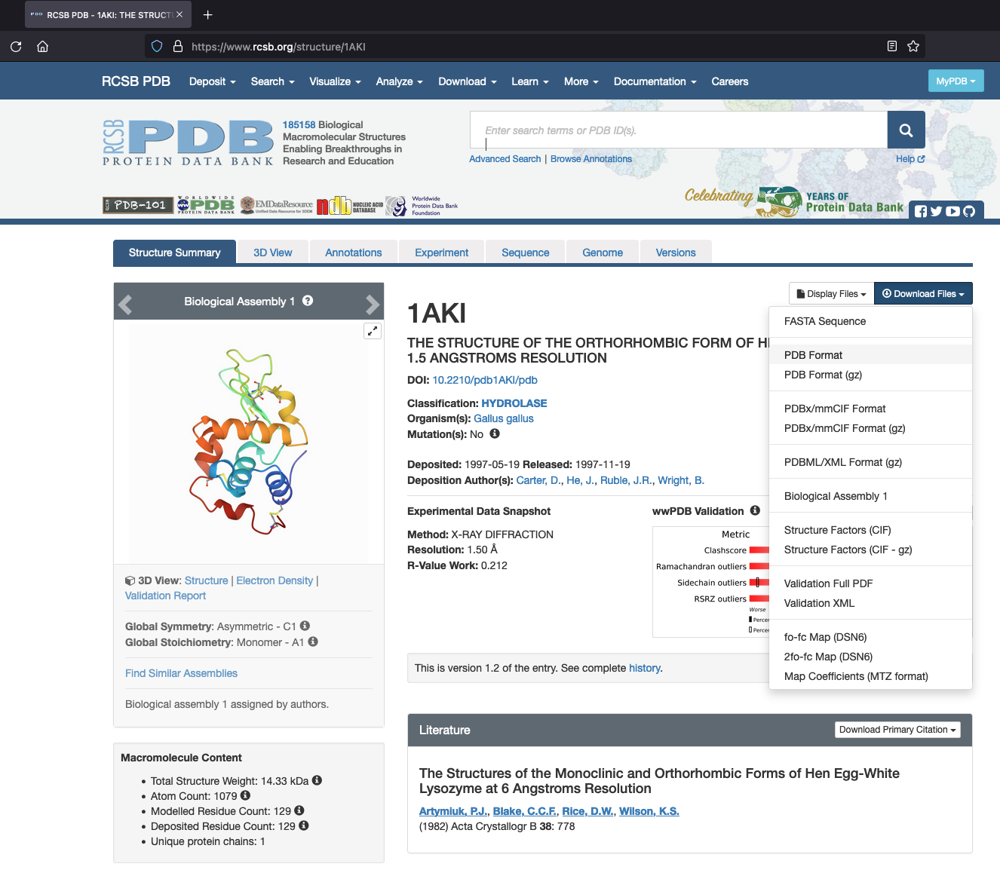
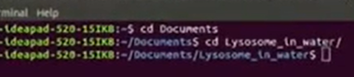

========================
İş Hazırlama Aşamaları
========================

Moleküler Dinamik simülasyon, üç temel adımdan oluşmaktadır:

#. Başlangıç yapısını hazırlamak

    * Protein veya polimerler için topoloji oluşturmak
    * Sisteme periyodik hücre ve çözücü eklemek
    * Çözünen sisteme iyon eklemek (sisteme yük dengesi sağlamak veya başka iyon eklenebilir.)

#. Etkileşim potansiyellerine giriş

    * Enerji minimizasyonu (Başlangıç yapısının simülasyon öncesi daha düşük enerjili hale gelmesi veya molekülün docking (yanaştırma) için hazırlanmasını sağlar.)

#. Parçacıkların hareketini öngörmek

    * MD simülasyonu ile sistemin dengeye getirilmesi (Sistemin sabit sıcaklıkta ve sabit basınç/hacim altında dengeleye gelmesini sağlar.)
    * MD simülasyonu ile analiz için veri toplanması

Bu adımları göstermek amacıyla http://www.mdtutorials.com/gmx adresindeki 1 numaralı ``Lysozyme in water`` örneği üzerinden gidilmiştir [http://www.mdtutorials.com/gmx/lysozyme/01_pdb2gmx.html (Erişim tarihi: 15.07.2021)]. Öncelikle https://www.rcsb.org/ adresine gidip arama motoruna ``1AKI`` yazarak lizozimin protein yapısı PDB formatında indirilmelidir:

   
PDB dosyası indirilenler klasörün içerisinde ``1aki.pdb`` şeklinde bulunabilir. Öncelikle terminalde ``pdb`` dosyasını bulmak için;

.. code-block::

    cd Documents
    cd Lysozyme_in_water
    ls

Burada ``Documents`` yerine sizin pdb dosyasını kaydettiğiniz dosyanın bulunduğu dosyayı, 'Lysosome in water' yerine ise ``1aki.pdb`` dosyasının bulunduğu dosya adını yazınız [http://www.mdtutorials.com/gmx/lysozyme/01_pdb2gmx.html (Erişim tarihi: 15.07.2021)].

.. toctree::
    :maxdepth: 1

    gromacs_initialstruc.rst
    gromacs_interactpot.rst
    gromacs_mdsimulation.rst
    gromacs_vis_vmd.rst

