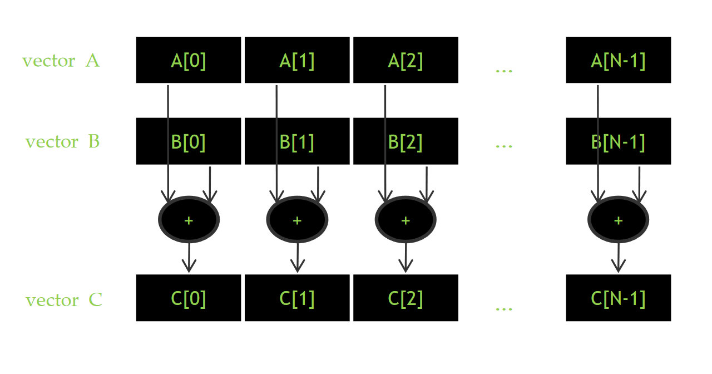
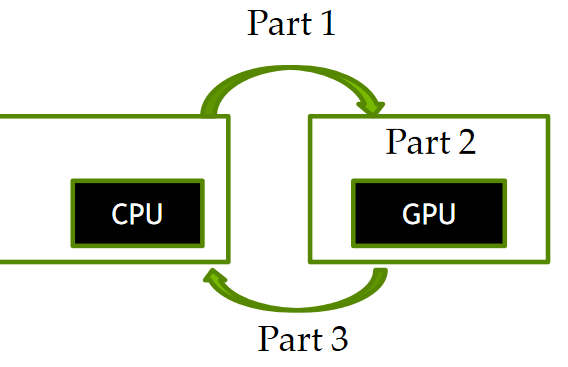
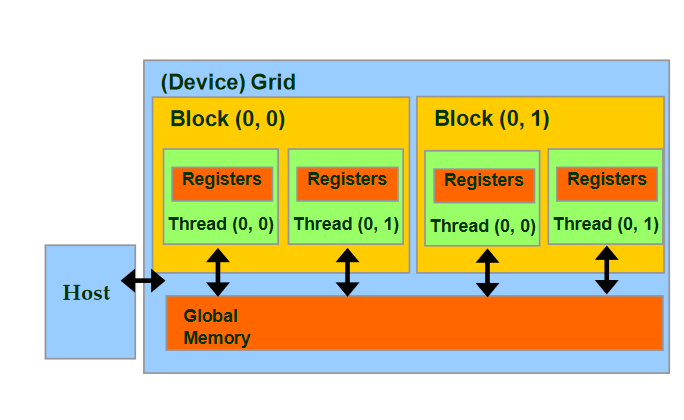

=============================
CUDA Bellek İşlemleri
=============================

Öğrenim Hedefleri
-----------------

*  Basit CUDA sunucu (ing., host, CPU) fonksiyonları hakkında bilgi sahibi olmak.

   *  Cihaz (GPU) bellek ayırma işlemi
   *  CPU-GPU veri kopyalama işlemi

Veri Paralelleşmesi
-------------------

Yukarıdaki görselde veri paralelleşmesi, vektör toplama işlemi üzerinde gösterilmektedir. 
Vektörün farklı elemanlarını sırayla toplamak yerine bütün elemanlar aynı anda toplanarak paralel 
bir hesaplama sağlanabilir. Burada önemli olan yapılacak işlemlerin birbirinden bağımsız olabilmesidir. 
Örnek üzerinden ilerlemek gerekirse, C[0] için A[0] ve B[0] elemanları toplanırken C[1] elemanı için A[1] ve B[1] 
elemanlarının toplanmasına engel teşkil eden bir durum yoktur. Yani bu iki işlem aynı anda gerçekleştirilebilir. 
Böylelikle veri seviyesinde paralelleşme elde edilir.

CUDA Vektör Toplama CPU Kodu: 1
-------------------------------
Önceki bölümde paralelleşme yapısından bahsettiğimiz vektör toplama örneğinin sunucu tarafında çalışan kodunu yakından 
inceleyelim. Kodun tamamına ulaşmak için :ref:`tıklayınız <cuda-vector-addition>`.

.. code-block:: C++

    void addVector()
    {
        //BOLUM-1
        cudaMalloc(&d_input1, inputLength * sizeof(int));
        cudaMalloc(&d_input2, inputLength * sizeof(int));
        cudaMalloc(&d_output, inputLength * sizeof(int));

        cudaMemcpy(d_input1, input1,inputLength * sizeof(int), cudaMemcpyHostToDevice); 
                
        cudaMemcpy(d_input2, input2,inputLength *  sizeof(int), cudaMemcpyHostToDevice);
        //BOLUM-1

        //BOLUM-2
        sumVector<<<32,512>>>(d_input1,d_input2,d_output,inputLength); 
        cudaDeviceSynchronize();
        //BOLUM-2

        //BOLUM-3
        cudaMemcpy(output, d_output, inputLength * sizeof(int), cudaMemcpyDeviceToHost); 
        cudaFree(d_input1);
        cudaFree(d_input2);
        cudaFree(d_output);
        //BOLUM-3
    }

Kodun BOLUM-1 kısmında bellek ayırma işlemi ve toplanacak verilerin cihaza (GPU) aktarımı sağlanmaktadır. 
Ardından BOLUM-2 kısmında vektör toplama işlemi yapan çekirdek (kernel) çağrılıp toplama işlemi sağlanmaktadır.
BOLUM-3 ise cihaz üzerinde yapılan hesaplamanın sonucunu sunucu tarafına (CPU'ya) kopyalama işlemini ve ardından kullanılan belleğin temizleme işlemini içermektedir.

Genel bir CUDA programındaki akış aşağıdaki görselle açıklanabilir.

* Hesaplamada kullanılacak veri için yeterli bellek miktarı GPU belleği üzerinde ayrılır ve hesaplamada kullanılacak veri GPU belleğine kopyalanır.
* GPU çekirdeği (kernel) ile gerekli hesaplama işlemini gerçekleştirir.
* GPU belleğinde bulunan sonuç CPU'ya kopyalanır ve GPU'da bu hesaplama için kullanılmış bellek temizlenir. 

CUDA Bellek Yapısı 
------------------

*  En basit haliyle CUDA bellek yapısını inceleyelim. Cihaz üzerinde bulunan evrensel (global) bellek ve her ayrı iş parçacığının (thread) kendi bellekleri turuncu ile gösterilmiştir. 

   *  GPU tarafında çalışan kod bu evrensel belleğe ve iş parçacıklarının kendi yerel belleklerine veri yazma ve veri okuma işlemlerini gerçekleştirebilir.
   *  CPU tarafında çalışan kod ise evrensel bellek alanında yazma ve okuma işlemleri gerçekleştirebilir.

İlerleyen bölümlerde CUDA bellek yapısının çok daha detaylı olarak inceleyeceğiz. Bellek yönetim fonksiyonlarından bahsetmeden önce bu iki ana noktayı bilmemiz yeterlidir.

CUDA Bellek Yönetim Fonksiyonları
---------------------------------

cudaMalloc
^^^^^^^^^^^^

*cudaMalloc* fonksiyonu C programlama dilindeki malloc fonksiyonuna benzer bir şekilde, bellekte veri için yer açmamıza olanak sağlar. 
*cudaMalloc* kullanılarak GPU üzerindeki **evrensel bellekte** yer ayırma işlemini gerçekleştirilir. 

*  *cudaMalloc* iki adet parametre kabul etmektedir: 

   *  Ayrılan bellek bölgesinin adresinin yazılacağı işaretleyici değişken,
   *  Ayrılacak alanın büyüklüğü.

malloc fonksiyonundan farklı olarak *cudaMalloc*'un ayırdığı bellek bölgesinin adresini parametre olarak kabul etmesinin sebebi her CUDA fonksiyonunun bir hata kodu döndürüyor olmasıdır. 
Bu hata koduna bakılarak, çalıştırılmış işlemin başarıyla tamamlanıp tamamlanmadığı anlaşılabilir. Hata içeriği hakkında bilgi sahibi olmak açısından hata kodlarını kontrol etmek kritik bir 
öneme sahiptir. 

cudaFree
^^^^^^^^^^

*cudaFree* fonksiyonu, C programlama dilindeki free fonksiyonu ile benzer şekilde parametre olarak kabul ettiği alandaki veriyi temizlemek için kullanılır. 
*cudaFree* parametre olarak aldığı adresi GPU evrensel belleğinden silerek serbest bırakır.

cudaMemcpy
^^^^^^^^^^^^

Üzerinde hesaplama yapacağımız veriyi ana bellekten, grafik işlem biriminin belleğine aktarmamız gerekir. 
Bunu yapmak için öncelikle veri boyutu kadar yer ayırmamız (allocation) ve ardından veriyi kopyalamamız gerekir. 
Veri boyutu kadar yer açmak için cudaMalloc'u kullanabileceğimizi görmüştük. Veriyi kopyalamak için ise *cudaMemcpy* fonksiyonu kullanılabilir.

*  cudaMemcpy dört adet parametre kabul etmektedir: 

   *  Kopyalanacak verinin nereye kopyalanacağı (adres),
   *  Kopyalanacak verinin nereden kopyalanacağı (adres),
   *  Kaç bayt veri kopyalanacağı,
   *  Verinin hangi yönde kopyalanacağı (CPU->GPU veya GPU->CPU).

*cudaMemcpy* fonksiyonunun kabul ettiği parametreleri incelediğimizde de görüldüğü üzere iki adet adres parametresi almaktadır. 
Olası bir karışıklığı önlemek adına bir örnek üzerinden ilerlemek gerekirse CPU üzerinde bulunan bir verinin cihaza kopyalanması için *cudaMemcpy* 
fonksiyonunun ilk parametresi cihaz bellek alanından bir adres, ikincisinin ise CPU bellek alanından bir adres olması gereklidir. 

Burada dikkat edilmesi gereken en önemli durum ise bu kopyalama işleminin CPU'ya göre **senkron** şekilde ilerlemesidir, yani iki adet *cudaMemcpy* fonksiyonu çağrıldığında 
ilki bittikten sonra ikinci kopyalama işlemi başlar. İlerideki bölümlerde nasıl **asenkron** veri kopyalama işlemi yapılacağını ve bunun ne gibi bir katkı sağlayacağını da göreceğiz.

CUDA Vektör Toplama Kodu: 2
-------------------------------

CUDA bellek fonksiyonları ile ilgili şu ana kadar öğrendiklerimizle birkaç bölüm yukarıda program akışını göstermek için kullandığımız örneği daha yakından inceleyebiliriz.

.. code-block:: C++

    void addVector()
    {
        //BOLUM-1
        cudaMalloc(&d_input1, inputLength * sizeof(int));
        cudaMalloc(&d_input2, inputLength * sizeof(int));
        cudaMalloc(&d_output, inputLength * sizeof(int));

        cudaMemcpy(d_input1, input1,inputLength * sizeof(int), cudaMemcpyHostToDevice); 
                
        cudaMemcpy(d_input2, input2,inputLength *  sizeof(int), cudaMemcpyHostToDevice);
        //BOLUM-1

        //BOLUM-2
        ...
        //BOLUM-2

        //BOLUM-3
        cudaMemcpy(output, d_output, inputLength * sizeof(int), cudaMemcpyDeviceToHost); 
        cudaFree(d_input1);
        cudaFree(d_input2);
        cudaFree(d_output);
        //BOLUM-3
    }

*  Vektör toplama işleminin gerçekleşeceği iki vektör için cihaz üzerindeki evrensel bellekte yeterli miktarda yer açılmıştır (*cudaMalloc*), ayrıca toplama işleminin sonucunda oluşacak vektör için de aynı boyutta bir yer ayırma işlemi yapılmıştır (BOLUM-1).

*  Ayrılan yere *cudaMemcpy* ile toplama işleminde kullanılacak iki vektör kopyalanmıştır. Burada kopyalamanın yönü **cudaMemcpyHostToDevice** olarak verilmiştir. Çünkü toplama işlemi yapacağımız vektörler programın başında ana bellekte bulunmaktadır (BOLUM-2).

*  Toplama işlemi bittikten ve sonuç vektörü cihaz belleği üzerinde hazır olduktan sonra, sonuç CPU'ya geri kopyalanmıştır. Burada kopyalamanın yönü **cudaMemcpyDeviceToHost** olarak verilmiştir (BOLUM-3).

*  Cihaz belleği üzerindeki ayrılmış alanlar işlem bittiğinde *cudaFree* fonksiyon ile serbest bırakılmıştır (BOLUM-3).

CUDA Birleşik Bellek (Unified Memory)
-------------------------------------

Önceki örnekte de gördüğünüz üzere ana bellek ve cihaz belleğini birbirinden bağımsız olarak yönetmek programlayıcının sorumluluğundadır. 
Bu durum karışık bellek işlemlerinde zorluk oluşturabilmektedir. Bu karmaşıklığı ortadan kaldırmak için birleşik bellek kullanılabilir.

Birleşik bellek modeli ile birlikte programlayıcı iki ayrı bellek alanını idare etmek yerine tek bir bellek alanı ile ilgilenebilir ve 
gerekli veri geçişleri otomatik sağlanır. Birleşik bellek sistemi hem yazılımsal hem de donanımsal desteğe (Pascal ve sonraki mimarilerde) sahiptir.
*Pascal mimarisi* öncesi grafik işlem birimlerinde birleşik bellek performansı, *Pascal* sonrası mimarilere göre daha düşüktür. Bunun nedeni 
eski grafik işlem birimlerinde "Sayfa Taşıma Motoru" (ing., Page Migration Engine) bulunmadığından gerekli veri taşıma işlemi sırasında bütün 
veri sayfaları taşınmaktadır. *Pascal* ve sonraki mimarilerde ise sayfa hatası (ing., page fault) mekanizması bulunduğundan sadece gerekli sayfaların taşınması mümkündür.

Vektör toplama işlemi için birleşik bellek kullanan bir örneği inceleyelim.

.. code-block:: C++

   //BOLUM-1
   float *input1, *input2, *output
   cudaMallocManaged(&input1, n * sizeof(float));
   cudaMallocManaged(&input2, n * sizeof(float));
   cudaMallocManaged(&output, n * sizeof(float));
   //BOLUM-1

   //BOLUM-2
   ...   
   //BOLUM-2

   //BOLUM-3
   cudaFree(A);
   cudaFree(B);
   cudaFree(C);
   //BOLUM-3

Görüldüğü üzere birleşik bellek kullanımı ile birden fazla bellek alanı ile ilgilenmek yerine tek bir bellek alanı oluşturup onun üzerinden ilerleyerek 
işlemlerimizi gerçekleştirebiliyoruz. Burada dikkatimizi çekecek önemli bir kısım sonuç vektörünün ana belleğe geri kopyalama işlemini yapmıyor oluşumuzdur. 
Birleşik bellek kullanımı ile bu gereksinim otomatik olarak sağlanır.

Ayrıca birleşik bellek modeli **asenkron** işlemleri de desteklemektedir. Birleşik bellek modelini daha detaylı olarak ilerleyen bölümlerde inceleyeceğiz, ancak özetlemek gerekirse:

*  Birleşik bellek modeli ile oldukça basit bir şekilde grafik işlem birimi üzerinde yaptığımız hesaplamalarda bellek işlemlerini yönetebiliriz. 
*  Kullandığımız grafik işlem biriminin mimarisi birleşik bellek performansında önemli bir etkiye sahiptir. 

Hata Kontrolü
-------------

Daha önceki bölümlerde CUDA fonksiyonlarının bir hata kodu döndürdüğünden bahsetmiştik. Bu noktada kodumuzla ilgili sorunları anlayabilmemiz açısından bu hata 
kodlarını kontrol etmek oldukça önemlidir. Örnek bir hata kontrolü kodunu inceleyelim:

.. code-block::

   cudaError_t err = cudaMalloc((void **) &d_input1, size);

   if (err != cudaSuccess)  
   {
      printf(“%s in %s at line %d\n”,   cudaGetErrorString(err), __FILE__,__LINE__);
      exit(EXIT_FAILURE);
   }

Hem bütün fonksiyonların hata kodlarını kontrol etmek, hem de bunu kodun okunuşunu değiştirmeden yapmak için genellikle bir makro hazırlanılarak her CUDA fonksiyonu 
hata kontrolünden geçirilir.

.. code-block:: C++

   #define cudaCheckError() {                                             
      cudaError_t e = cudaGetLastError();
      if(e != cudaSuccess) {
            printf("Cuda failure %s:%d: '%s'\n",__FILE__,__LINE__,cudaGetErrorString(e));
            exit(EXIT_FAILURE);
      }
   }
