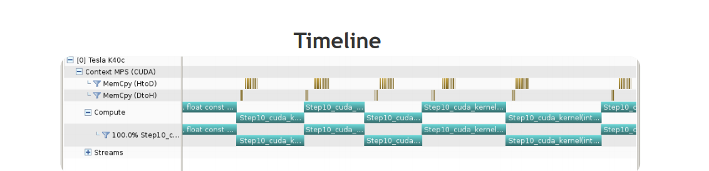
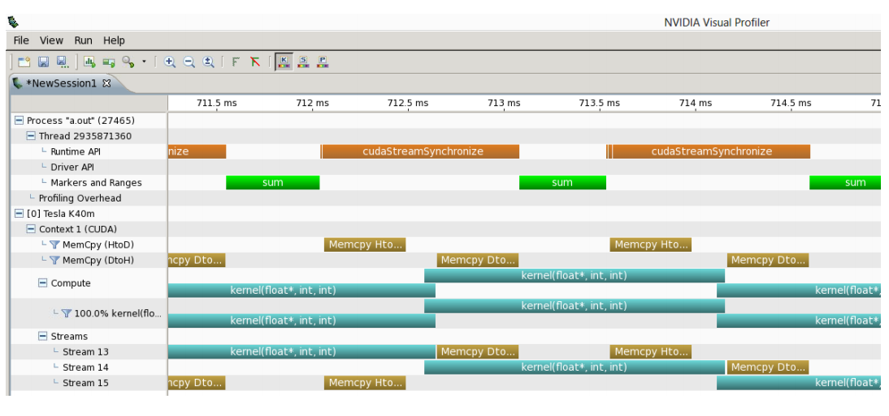
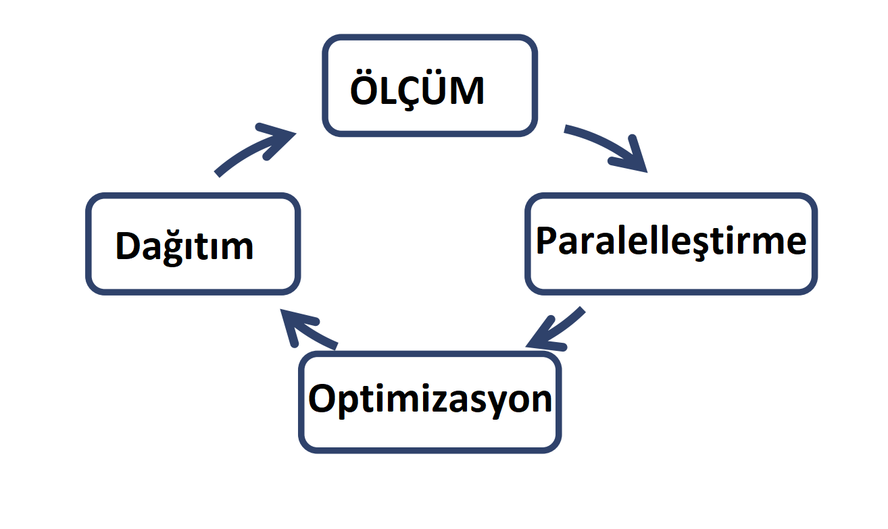

======================
CUDA Araç Kiti
======================

Öğrenim Hedefleri
-----------------

*  CUDA araç kitindeki önemli araçlardan bazıları hakkında bilgi sahibi olmak. 

   *  Derleyici direktifleri
   *  Hata ayıklayıcılar
   *  Performans Profilleyici

NVCC Derleyici
--------------

CUDA derleme işlemleri için *nvc* derleyicisi kullandığımızdan bahsetmiştik ve basit bir *.cu* dosyasını nasıl derlediğimizi belirtmiştik. 
Bu bölümde *nvcc* derleyicisinin nasıl kullanıldığını örneklerle inceleyeceğiz.

Merhaba Dünya!
^^^^^^^^^^^^^^

.. code-block:: C++

    #include <cstdio>
    __global__ void mykernel(void) 
    {
    }

    int main(void) 
    {
        mykernel<<<1,1>>>();
        printf("Merhaba Dünya\n");
        return 0;
    }

Yukarıdaki kod örneğini compile etmek için *.cu* uzantılı bir dosyaya alıp 

.. code-block:: C++

    nvcc main.cu

komutuyla derleyebilirsiniz. 
Bu noktada dikkat edilmesi gereken nokta nvcc derleyicisi *.cu* uzantıları dışındaki dosyaları derlemeyeceğidir. 
Eğer *.cu* dışında uzantılı bir dosyayı derleme işlemi gerçekleştirmek isterseniz *-x cu* derleyici direktifini kullanabilirsiniz.

**Örnek:**

.. code-block:: C++

    nvcc -x cu main.cc

Hata Ayıklayıcılar
------------------

CUDA kodlarındaki hata ayıklama işlemlerinde kullanabileceğimiz çeşitli hata ayıklayıcılar bulunmkatadır.

*  NVIDIA tarafından sunulan hata ayıklayıcılar ve araçlar:

   *  Nsight
   *  CUDA - GDB
   *  CUDA MEMCHECK

*  Üçüncü parti çözümler:

   *  arm Forge
   *  TotalView 

Derleyici Direktifleri
----------------------

Hata ayıklama işlemini gerçekleştirmek için öncelikle derleyici direktiflerinden bahsetmemiz gerekiyor. 
CUDA derleme sürecince iki adet derleyici kullanıldığını hatırlayalım. 
Bir derleyici CPU/sunucu kodunu derlerken, *nvcc* derleyicisi cihaz kodunu derliyor. 

* Eğer CPU kodunu derleyecek olan derleyiciye yollanmak istenen derleyici direktifleri varsa **-Xcompiler** direktifi oldukça kullanışlı olacaktır. Çünkü **-Xcompiler** sonrasında girilen direktifler doğrudan CPU kodunu derleyen derleyiciye aktarılır.

**Örnek**

.. code-block:: C++

    nvcc main.cu -Xcompiler -fopenmp

.. note::
    
    -fopenmp direktifi OpenMP kodlarını derlemek için kullanılır.

* **-g** direktifi CPU kodunun hata ayıklama sembollerinin oluşturulan programa eklenmesini sağlar.
* **-G** direktifi cihaz kodunun hata ayıklama sembollerinin oluşturulan programa eklenmesini sağlar.
* **-lineinfo** direktifi ise satır bilgisinin oluşturulan programa eklenmesini sağlar. Böylece hata ayıklarken, hatanın oluştuğu satırı da anlayabiliriz.

CUDA - MEMCHECK
---------------

CUDA - MEMCHECK, CUDA kodlarında oluşan bellek tabanlı hataları algılamak için kullanılabilecek önemli bir araçtır. Kullanmak için CUDA programının baştan derlenmesi gerekmez.

.. code-block:: C++

    cuda-memcheck ./program.out

şeklinde kullanılabilir.

*  CUDA - MEMCHECK şu hataları algılayabilir:

   *  Bellek Sızıntıları (ing., memory leaks)
   *  Bellek Hataları (sınır dışı bellek erişimi (OOB), hizasız bellek erişimi (ing., misalligned access) vb.)
   *  Yarışma Durumu (ing., race condition)
   *  Yanlış Bariyerler
   *  Başlatılmamış Bellek Kullanımı (ing., uninitialized memory)

CUDA - MEMCHECK kullanırken satır bilgisini eklemek işimizi oldukça kolaylaştıracaktır. Satır bilgisinin eklendiğinden emin olmak için aşağıdaki direktifler kullanılabilir.

.. code-block:: C++

    -Xcompiler -rdynamic -lineinfo

CUDA - MEMCHECK ile ilgili daha detaylı bilgi için :  http://docs.nvidia.com/cuda/cuda-memcheck

CUDA - GDB
----------

GNU Hata Ayıklayıcısının bir eklentisi olan **CUDA - GDB**, GPU ve CPU kodunda hata ayıklama işlemleri için kullanılabilmektedir. 
CUDA-GDB Linux ve Macintosh sistemlerde çalışmaktadır. Windows sistemler için *Nsight* hata ayıklaycısını kullanabilirsiniz.

*  Bazı kullanışlı **CUDA-GDB** komutları : 

   *  **b main** : mainde duraksama noktası yaratır.
   *  **r** : programı çalıştırır / çalışıyorsa baştan çalıştırır. 
   *  **l** : Şu anda bulununan satırdaki (ve çevresindeki) kodları ekrana bastırır.
   *  **c** : program çalıştırmasını devam ettirir.
   *  **cuda thread** : Şu anki iş parçacığını ekrana bastırır.
   *  **cuda thread 10** : 10. iş parçacığına geçiş yapar.
   *  **cuda block** : Şu anki bloğu ekrana bastırır.
   *  **cuda block 1** : 1. bloğa geçiş yapar.
   *  **d** : Bütün duraksama noktalarını siler.
   *  **set cuda memcheck on** : CUDA - MEMCHECK'i başlatır.

CUDA-GDB hakkında daha detaylı bilgi için : http://docs.nvidia.com/cuda/cuda-gdb

Performans Profilleyiciler
--------------------------

CUDA programlarında performans ölçümleri ve darboğaz tespitlerini yapmak için kullanabileceğimiz çeşitli performans profilleme araçları bulunmaktadır.

NVPROF
^^^^^^

PROF derleyicisinin bir uzantısı olarak geliştirilmiş **nvprof**, komut satırı üzerinden kullanılan bir performans profilleyicisidir.

*   Her CUDA **çekirdeğinin** (kernel) sonuçlanması için geçen süre
*   Bellek transfer süreleri 

gibi öğeler **nvprof** tarafından toplanır. CUDA programlarımızda yapacağımız optimizasyonların belirlenmesi açısından **nvprof** oldukça önemli ve kullanımı basit bir araçtır.

**nvprof** kullanmak için kodu baştan derlemeniz gerekmemektedir.

**Örnek**:

.. code-block:: C++

    nvprof ./program.out

NVVP
^^^^

**NVVP** bir CUDA programı hakkında kullanıcı arayüzü ile performans bilgilerini gösterir. 
Program hakkındaki performans bilgileri bir zaman çizgisi üzerinde gösterilir.
**nvprof** gibi bellek işlemlerinde de kullanışlı bilgiler sağlar.

NVTX
^^^^

Gördüğümüz performans profilleyicileri sadece CUDA uygulama programlama arayüzüne ait fonksiyonları profillerler. 
Eğer CPU tarafında oluşmakta olan diğer durumlar hakkında bilgi sahibi olmak isterseniz, **nvtx** eklentisi kullanılabilir.

CPU kodundaki yapılan işlemlerin (CUDA UPA'sı dışındaki fonksiyon çağrıları) performansını onları **nvtx alanlarıyla** işaretleyerek detaylı bir şekilde analiz edebiliriz.

**nvtx**'i kullanarak CPU kodunda incelemek istediğiniz kod bloğunun başını **nvtxRangePushA("alan_adı")**, sonunu ise **nvtxRangePop()** ile işaretlemeniz gerekir. 
İç içe geçmiş alanlar kullanabilirsiniz. **nvtx** kullanmak için 

.. code-block:: C++

    #include <nvToolsExt.h>

başlık (header) dosyasını eklemeniz gerekmektedir. 
Ayrıca **-lnvToolsExt** kütüphanesi ile bağlama (ing., linking) işlemi yapmayı unutmayınız.

**NVTX** hakkında daha detaylı bilgi için: http://devblogs.nvidia.com/parallelforall/cuda-pro-tip-generate-custom-application-profile-timelines-nvtx/

**NVTX** eklentisi ile genişletilmiş görseli yukarıda görebilirsiniz. Burada *sum* adlı alan **nvtx** eklentisi ile profillenebilmiştir.

Nsight
------

**Nsight**, CUDA araçlarının bir arada bulunduğu bir tümleşik geliştirme ortamıdır (ing., integrated development environment). 
CUDA kodu geliştirmek için komut satırı araçlarını tercih etmiyorsanız, **NSIGHT** ile geliştirme yapabilirsiniz.

*  **Nsight :** 

   *  Kaynak kodu editleyici
        *   Windows : Visual Studio
        *   Linux/Macintosh : Eclipse
   *  Görsel hata ayıklayıcı
        *   Windows : Nsight VSE CUDA hata ayıklayıcısı
        *   Linux/Macintosh : kullanıcı arayüzü ile donatılmış cuda-gdb
   *  Performans profilleme aracı
        *   Windows : Nsight VSE 
        *   Linux/Macintosh : NVVP

Önerilen Geliştirme Süreci
--------------------------

CUDA programlarınızı geliştirirken önerilen geliştirme sürecini 4 aşamada inceleyebiliriz.

*   **Ölçüm:** performans profilleri kullanılarak programın parça parça performansı incelenir.
*   **Paralelleştirme:** önceki aşamada belirlenmiş olan darboğaz CUDA kullanılarak paralelleştirilir.
*   **Optimize etme:** paralelleştirilen kısmın optimizasyonu sağlanır ve gerekli ölçümler profilleyiciler ile yapılır.
*   **Dağıtım:** programın dağıtımı sağlanır.

Bu süreç bir döngü içerisinde ilerler. Aşağıdaki görsel sürecin kısa bir özeti olarak incelenebilir.

