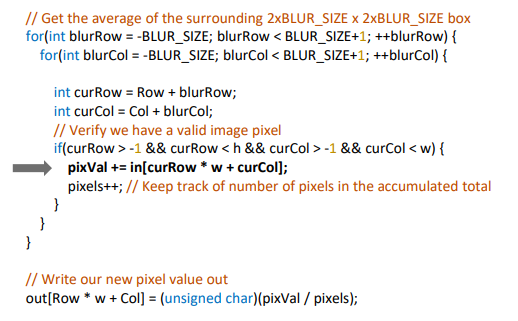
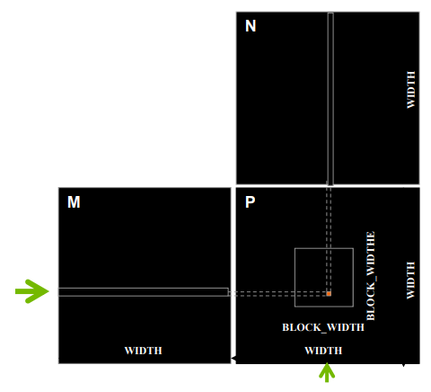
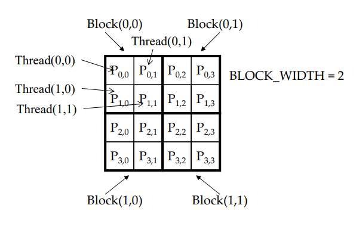
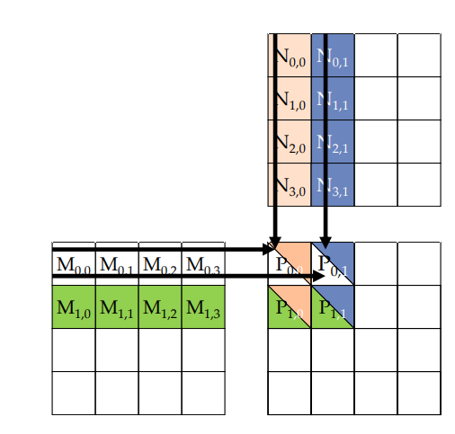
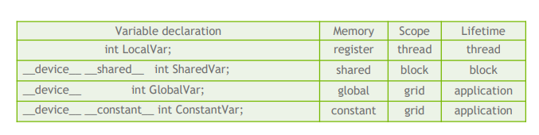

Bellek ve Veri Lokalizasyonu
============================

Öğrenim Hedefleri
-----------------

*  Farklı CUDA bellek tiplerini etkili şekilde kullanabilmek

   *  Bellek erişiminin önemi
   *  Registerlar, evrensel bellek ve paylaşımlı bellek
   *  Kapsam (ing., scope) ve yaşam süresi (ing., lifetime)

İnceleme: Resim Bulanıklaştırma Çekirdeği
-----------------------------------------

Bir önceki bölümde incelediğimiz resim bulanıklaştırma çekirdeğini bellek erişimi açısından inceleyelim. 
Önce, bu çekirdekteki bellek erişimi açısından en kritik satırı gösteren aşağıdaki görsele bakalım.

.. code-block:: C++

   pixVal += in[curRow * w + curCol];

İşaretli olan bu satırda görmüş olduğunuz bir kayan nokta operasyonu (floating point operation, **FLOP**) olan toplama işlemi için bir adet bellek erişimi gerçekleşmektedir. 
Yani bir **FLOP** için 4 baytlık (*C* dilinde float tipindeki değişken 4 bayttır) DRAM bellek bant genişliği (ing., bandwidth) gerektirmektedir.

Tipik bir CUDA Grafik İşlem Biriminde 1600 GFLOPS işlem, 600GB/s DRAM bant genişliği kapasitesi bulunmaktadır. 
1600 GFLOPS işlem yapabilmek için 4*1600 = 6400GB/s veri transferi yapabilen bir bant genişliği gerekmektedir. 
Ancak 600GB/s bant genişliğine sahip olan tipik bir grafik işlem biriminde maksimum ulaşılabiliecek işlem 600/4 = 150 GFLOPS olacaktır. 
Bu da maksimum işlem kapasitesinin %9.375 (150/1600) kısmının kullanıldığını gösterir. 
Bu performans kaybını engellemek için farklı bellek erişim modelleri kullanmak gereklidir. 
Bellek erişiminin alacağımız performans açısından ne kadar kritik olduğunu gördük. 
İlerleyen bölümlerde resim bulanıklaştırma örneğinin bellek lokalizasyonu hakkında incelemede bulunacağız ancak daha basit bir örnek olan matris çarpımı üzerinden bu konuyu inceleyelim.

Basit Matris-Matris Çarpımı
---------------------------

En basit haliyle matris-matris çarpımı yapmak için bir matrisin her satırı ile diğer matrisin her sütunu arasında iç çarpım gerçekleşmektedir. 
Bu işlemi daha iyi anlayabilmek için aşağıdaki görseli inceleyiniz.

Temel olarak şu ana kadar incelediğimiz çok boyutlu CUDA çekirdekleri ile benzer yapıya sahip olan bu örneği inceleyiniz.

.. code-block:: C++

   __global__ void MatrixMulKernel(float* M, float* N, float* P, int Width) {
         // satir indisi
         int Row = blockIdx.y*blockDim.y+threadIdx.y;

         // sutun indisi
         int Col = blockIdx.x*blockDim.x+threadIdx.x;
         
         if ((Row < Width) && (Col < Width)) {
            float Pvalue = 0;
            // her is parcacigi bir sonuc hesaplıyor
            for (int k = 0; k < Width; ++k) {
               Pvalue += M[Row*Width+k]*N[k*Width+Col];
            }
            P[Row*Width+Col] = Pvalue;
         }
   }

Gördüğünüz üzere gerekli satır ve sütun indisleri hesaplandıktan sonra her bir iş parçacığı sonuç matrisindeki bir eleman için hesaplamayı gerçekleştiriyor. 
Bu noktada 4x4 boyutlarında bir matrisi düşünelim ve blok ve şebeke (grid) yapısını aşağıdaki görselde gösterildiği gibi konfigüre edelim.

Bu noktada her bir sonuç için gerek duyulan veriyi gösteren aşağıdaki görseli inceleyelim.

Gördüğünüz üzere her bir satır birden fazla sayıda kullanıyor. 
Örnek vermek gerekirse yukardaki görselde gösterilen **M** matrisinin ilk satırındaki değerler sonuç matrisinin ilk satırının her elemanı için gereklidir. 
Bu gibi, verinin birden fazla kullanıldığı durumları tespit edip uygun CUDA bellek yapılarını kullanarak performansımızda yüksek artışlar sağlayabiliriz.

CUDA Değişken Tanımlama
------------------------

Aşağıdaki görselde çeşitli değişken tanımlarını ve bu tanımların hangi CUDA bellek tipine karşılık geldiğini görebilirsiniz.

* **_device_** etiketinin **_shared_** veya **_constant_** ile kullanımı opsiyoneldir.
* Her **iş parçacığında** bulunan diziler (ing., array) hariç, otomatik değişkenler **yazmaçlara** (ing., register) yerleştirilir.

CUDA Paylaşımlı Bellek ve Örnek Kullanımı
-----------------------------------------

Her **SM** için özel olarak bulunan, ulaşması **evrensel belleğe** göre daha hızlı olan özel bir bellek türüdür. 
Her bir **iş parçacığı bloğu** tarafından birbirinden bağımsız olarak ulaşılır ve kullanılır. 
Kapsamı (ing., scope) **bloktur**. Aynı şekilde yaşam ömrü (ing., lifetime) de **blok** sona erdiğinde sona erer.

Hesaplamada her bir **blok** tarafından birden çok kere kullanacağımız veriyi **paylaşımlı belleğe** koymaya çalışırız. 
Böylece aynı veri için ulaşım süresi daha uzun olan **evrensel belleği** beklemek zorunda kalmayız.

Örnek: Paylaşımlı Bellekte Değişken Tanımlama:
----------------------------------------------

.. code-block:: C++

   void blurKernel(unsigned char * in, unsigned char * out, int w, int h) {
      __shared__ float ds_in[TILE_WIDTH][TILE_WIDTH]; ...
   }