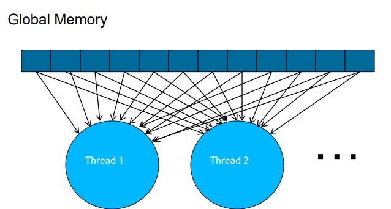
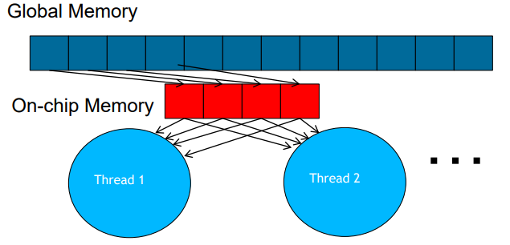
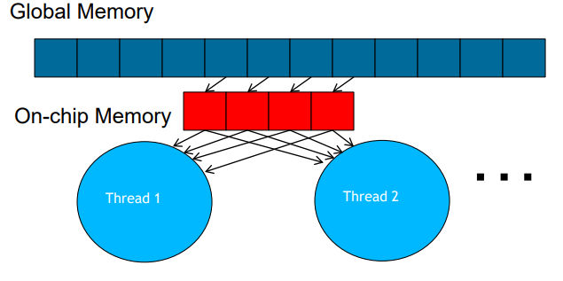
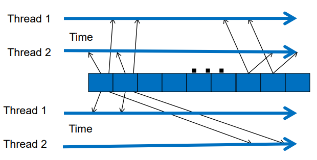

============================
Bölmeli (Tiled) Algoritmalar 
============================

Öğrenim Hedefleri
-----------------

*  Bölmeli (ing., tiled) algoritmaların neden kullanıldığını anlamak
 
   *  Paralel çekirdek performansında bellek bant genişliğinin etkisini azaltmak
   *  Bölmeli algoritmalar ve bariyer senkronizasyonu

Basit Matriks Çarpımı Evrensel Bellek Erişim Modeli
----------------------------------------------------

Bir önceki bölümde incelediğimiz basit matriks çarpımının evrensel belleğe erişim modelini aşağıdaki görsel üzerinden inceleyelim.

Basit matriks çarpım işleminde matriks elemanlarına birden fazla iş parçacığı ulaşmaktakdır. 
Bu durumda evrensel bellekte aynı veriye farklı iş parçacıkları ulaşmaktadır. Bu da bellek erişimi açısından performansı kısıtlayıcı bir etkendir.

Bölmeli (Tiled) Bellek Erişimi
-------------------------------

Evrensel bellek üzerinde birden fazla kere ulaşılan **bölmeler**  (ing., tiles) çip üzerinde bulunan belleğe (ing., on-chip memory) taşınarak bellek erişimlerinin 
performansı arttırılabilir. Bu yaklaşımda evrensel bellekler **bölmelere** ayrılır ve sadece gerekli **bölme** çip üzerindeki belleğe taşınır.

Çip üzerindeki hafıza kısıtlı olduğundan, bu hafıza üzerindeki veri elemanları işlendikten sonra üzerine bir sonraki veri elemanları yazılır. 
Bizim algoritmamızda ilk  **bölme** ile ilgili işlemler bitince ikinci **bölme** işlenmeye başlar.

**Bölmeli** bellek erişimini oluşturmak için hesaplamanın bazı ön koşulları sağlaması gerekmektedir. 
Öncelikle bellek erişimi yapacak iş parçacıklarının (verinin hafızada bulunduğu) uygun zamanlarda bu erişimi gerçekleştirmesi gerekmektedir. 

Aşağıdaki görselde iş parçacıklarının bellek erişimlerinin yakın zamanlarda olduğu durum olan **bölmeli** bellek erişimi için daha uygun olan senaryo 
ve iş parçacıklarının bellek erişimlerinin birbirlerinden uzak olduğu **bölmeli** bellek erişimi için daha az uygun olan senaryo gösterilmiştir.

İş parçacıklarının benzer zamanlarda yaptığı bellek erişimleri aynı **bölmede** bulunduğu durumda **bölmeli** bellek erişimi kullanarak performans 
artışı sağlanmış olur. Aynı **bölme** içerisindeki veriye çeşitli iş parçacıklarının yakın zamanlarda erişimi performans artışını arttırır.

Bölmeli Bellek Erişimi İçeren İşlemlerde Senkronizasyon
-------------------------------------------------------

Daha önce bahsedildiği gibi, **bölmeli** bellek erişimi içeren işlemlerde gerekli hesaplama faz faz ilerlemektedir. 
Önce ilk fazda kullanılacak veri **bölmesi** çip üzerindeki belleğe kopyalanır ve işlenir. 
Ardından sonraki faza geçilir ve sıradaki faz için gerekli veri **bölmesi** aynı şekilde işlenir. 
Bu durum bir sonraki faza geçmeden önce bütün iş parçacıklarının o fazda yaptığı hesaplamayı bitirmesini gerektirir bu da senkronizasyon ile mümkündür. 
Bu senkronizasyonu daha detaylı bir şekilde ileriki bölümde göreceğiz.

Özet: Bölmeli Bellek Erişimi İçeren İşlemler
--------------------------------------------

*   Birden fazla iş parçacığı tarafından erişilen bir evrensel bellek bölmesi tespit edilir
*   Tespit edilen bu bellek **bölmesi** evrensel bellekten çip üzerindeki belleğe taşınır
*   Bütün iş parçacıklarının hesaplanacak faza başlamaya hazır olduğundan emin olmak için bariyer senkronizasyonu kullanılır
*   Birden fazla iş parçacığı çip üzerine kopyalanmış veriye erişim sağlar
*   Bütün iş parçacıklarının hesaplanan fazı tamamladığından emin olmak için bariyer senkronizasyonu kullanılır
*   Aynı işlemler bir sonrak **bölme** ile ilerletilir. 