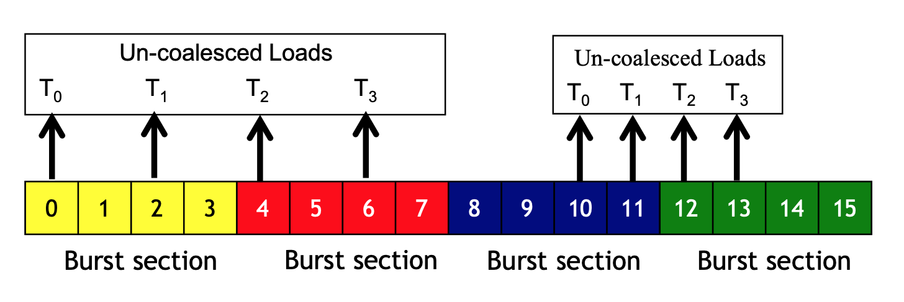

=========================================
CUDA Bellek Birleşimi 
=========================================

Öğrenim Hedefleri
-----------------
*  Bellek birleşiminin (ing., memory coalescing) bant genişliğini etkin şekilde kullanmak açısından önemini kavramak

   *  DRAM bursting ile bellek birleşiminin ilişkisi
   *  CUDA bellek erişimlerinin birleştirilmiş olup olmadığını kontrol etmek
   *  Bellek birleşimi sağlayabilmek için teknikler

DRAM Bursting
-------------

DRAM Burstingden bir önceki bölümde bahsetmiştik. Daha genel bir bakış açısı sağlamak gerekirse:

DRAM Bursting sayesinde bölümlere ayrılmış olan bellekte herhangi bir alana erişildiğinde aynı bölümde yer alan diğer alanların da transferi, 
aynı okuma işleminde sağlanabilmektedir. Yani yukardaki görselde sarı ile gösterilen bölümden herhangi bir alana erişim sağlanırsa (örnek olarak 2. alan) 
sarı alandaki diğer bölümlerin de transferi sağlanacaktır. Yukarda görmüş olduğunuz örnekte 16 baytlık bir bellek 4 baytlık **burst alanlarına** ayrılmış durumdadır. 
Gerçek sistemlerde bu **burst alanları** 128 byte veya daha fazla olabilir.

Bellek Birleşimi ve CUDA
--------------------------------------------

CUDA hesaplama modeli ile **bellek birleşimine** bakışımızı anlatan aşağıdaki görseli inceleyiniz.

Bir **warp** içerisindeki bütün **iş parçacıklarının** yaptığı bellek okuma işlemleri aynı **burst alanına** denk geliyorsa bu **warp** tek bir
bellek erişimi ile gerekli bütün veriye ulaşacağından **bellek birleşimi** özelliğine sahiptir.

Bellek birleşimine sahip olmayan bellek erişim modeli örneği için aşağıdaki görseli inceleyiniz.

Görüldüğü üzere **warp** içerisindeki **iş parçacıklarının** ulaşmaya çalıştıkları veri aynı **burst alanına** denk gelmediğinden 
birden fazla bellek erişimi yapılmak zorundadır. Bu da bellek erişiminin tamamiyle birleştirilmediği anlamına gelir. Bu da 
önemli performans kayıplarına yol açar. 

2 Boyutlu Matriks ve Bellek Erişim Modeli
-----------------------------------------

Yukardaki görselde 2 boyutlu bir **C** matriksinin lineerize edilmiş ve **burst alanlarına** ayrılmış halini görmektesiniz. 
Bu görseli aklımızda bulundurakak matriks-matriks çarpımında bellek erişim modelini inceleyelim.

Daha önceki modüllerde incelediğimiz basit matriks-matriks çarpımını simgeleyen aşağıdaki görseli inceleyiniz. 
Matriks **A** için sıralı **iş parçacıkları** sıralı satırlara erişirken, Matriks **B** için sıralı **iş parçacıkları** sıralı sutünlara ulaşmaktadır.

.. image:: ../../../assets/cuda/06/02/05.png
   :width: 500
   :align: center

Matriks **B** için yapılan bellek erişimleri birleşiktir. Bunu görmek için aşağıdaki görseli inceleyelim.

Görüldüğü üzere ilk iterasyonda **warp** içindeki **iş parçacıkları** (T0, T1, T2, T3) aynı **burst alanında** (sarı alan) bulunan veriye erişmektedir. 
İkinci iterasyonda aynı şekilde kırmızı alan ile devam edilmektedir.

Ancak matriks **A** için yapılan bellek erişimleri **birleşik** (ing., coalesced) değildir. Daha yakından bakmak için aşağıdaki görseli inceleyelim.

Görüldüğü üzere ilk iterasyonda aynı **warp** içindeki **iş parçacıkları** (T0, T1, T2, T3) farklı **burst alanlarından** veriye erişmektedir. 
İkinci iterasyonda da aynı şekilde farklı **burst alanlarındaki** veriye erişim devam etmektedir. Bu nedenle bu bellek erişimi birleşik değildir.