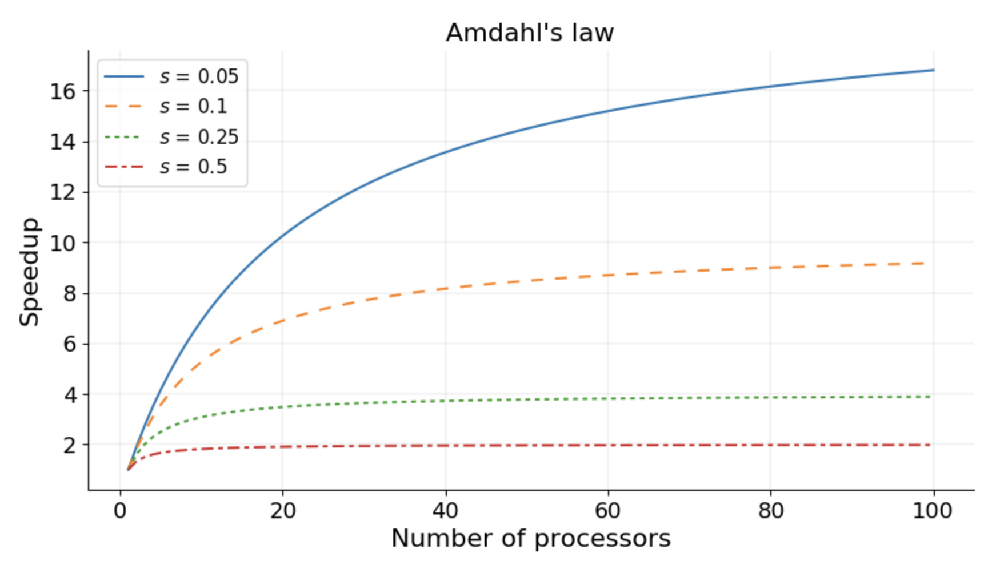
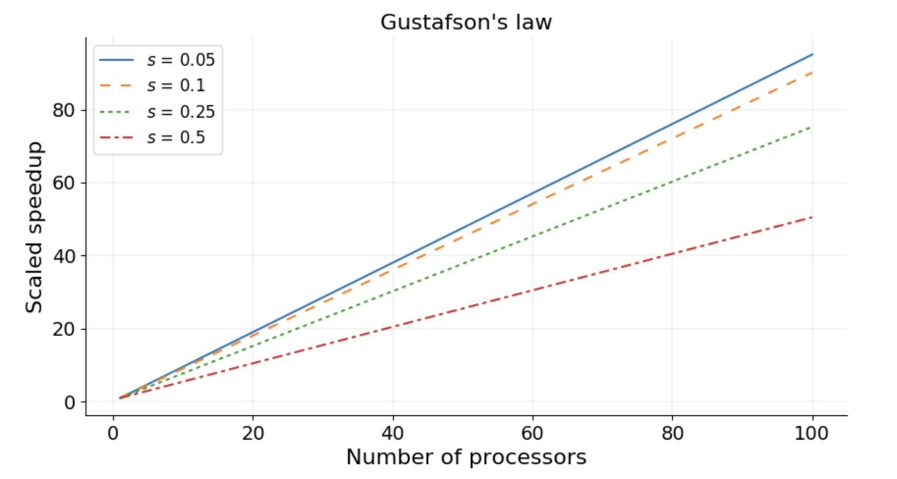

Seri ve Paralel Bölgeler
========================

Bir algoritma bir problemi çözmek için takip edilen adımlardan oluşur. Somut bir örnek vermek gerekirse bir araba nakil bandını düşünebiliriz. Nakil bandındaki her adım arabayı oluşturmak için bir işlem teşkil eder. Bu işlemler parça ekleme veya düzeltme olarak düşünülebilir. Bu işlemleri doğru sonuç alınacak şekilde sıraya koymak ve mümkünse bu işlemleri hızlandırmak büyük önem teşkil eder. 

Araba üretimi hızlandırmak isteyen bir şirket yeni bir nakil bandı satın ve iki kat daha fazla işçi işe alarak, iki araba üretme hızını yarıya indirebilir. Bu şekilde hızlandırılabilen problemler *utanç verici derecede paralel problemler* olarak adlandırılmaktadır. Ne yazık ki çoğu problem bu sınıfa dahil değildir.

Mesela butik bir araba üreticisiyseniz, sadece bir avuç araba yapmak için yeni bir montaj hattı inşa etmek, tasarruf edeceğinden daha fazla zaman ve paraya mal olmaktaysa, nasıl daha hızlı araba üretebilirsiniz? Tek yol, birden fazla kişinin aynı anda tek bir araba üzerinde çalışmasını sağlamaktır. Bunun için birbirini engellemeyen ve aynı anda uygulanabilecek adımların belirlenmesi gerekir, mesela arabanın moturu ve şasisi eş zamanlı inşa edilebilir. Algoritmalar da aynı özellikleri taşımaktadır. Bu dokümanda araba nakil bandı örneği ile tanıttığımız paralel algoritmaların özellikleri anlatılacaktır.

Veri Bağımlılığı
----------------

Birçok farklı alanda ve uygulamada birbirine veri olarak bağlı işlemler sonucunda bir hesaplama yaparız. Bir başka deyişle yinelemeli işlemler, bir değerin hesaplanıp bu değerin bir sonraki hesaplamada kullanıldığı, seri işlemler teşkil etmektedir ve bu tarz işlemler büyük ölçüde paralelleştirilemez. Aşağıda bir seri kod örneği verilmiştir:

.. code-block:: c

   old_value = starting_point
   for iteration in 1 ... 10000
      new_value = function(old_value)
      old_value = new_value

Örnekte ``new_value`` ``old_value`` kullanılarak elde edilmekte ve bu değer tekrar ``old_value``\ 'ya eşitlenmektedir. Yani döngünün bir önceki tekrarında hesaplanan değer bir sonraki tekrarda kullanılmaktadır. Bu durum veri bağımlılığı olarak adlandırılmaktadır. Döngü tekrarı ``k+1``\ 'deki ``new_value`` döngü tekrarı ``k``\ 'daki ``old_value``\ 'ya bağımlıdır. Veri bağımlılığı bir programdaki paralel ve seri bölgeleri belirler.

Yukarda bahsettiğimiz araba nakil bandında da bu şekilde kısıtlamalar ve bağımlılıklar düşünebiliriz. Mesela, bir arabanın tekerleklerini aynı anda, *paralel* bir şekilde, monte edebiliriz. Fakat bunu yapabilmek için arabanın aksının monte edilmiş olması gerekir. Araba aksının monte edilmesi ve tekerleklerin mont edilmesi aynı anda yapılamayacak işlemleri teşkil etmektedir. Bu analojide tekerlekleri monte etme işleminin aksı monte etme işlemine bağımlı olduğunu söyleyebiliriz.

Paralel bir şekilde çalıştırılamayan kısımları **Seri Bölgeler**\ , ve paralel olarak çalıştırılabilen kısımları **Paralel Bölgeler** olarak adlandırmaktayız. Bir program hiçbir zaman seri bölgelerin toplam süresinden daha hızlı çalıştırılamaz. Aşağıda seri ve paralel bölge örnekleri verilmiştir:

.. code-block:: c

   serial   | vector_0[0] = 1;
            | vector_1[1] = 1;
            | for i in 2 ... 1000
            |   vector_1[i] = vector_1[i-1] + vector_1[i-2];

   parallel | for i in 0 ... 1000
            |   vector_2[i] = i;

   parallel | for i in 0 ... 1000
            |   vector_3[i] = vector_2[i] + vector_1[i];
            |   print("The sum of the vectors is.", vector_3[i]);

Ölçeklenebilirlik
-----------------

Bir parallel programın hızlanması, bu programın tek bir işlemci ile çalışma süresinin, N işlemci ile çalışma süresine olan oranı olarak tanımlanmıştır. İdeal olarak hızlanmanın kullanılan işlemci sayısına eşit olmasını, ``hızlanma = N``\ , isteriz. Böylece bütün işlemciler işlemci gücünün tamamını kullanmış olurlar. Fakat birazdan bahsedeceğimiz sebepler yüzünden bu durum çoğu zaman gerçekleştirilemez.

Amdahl Yasası ve Güçlü Ölçekleme
^^^^^^^^^^^^^^^^^^^^^^^^^^^^^^^^

Amdahl yasası paralel programlama ile elde edilebilecek teorik hızlanma limitini tanımlamaktadır: Sabit bir problem için hızlanmanın üst sınırı kodun seri kısmı tarafından belirlenir. Buna güçlü ölçekleme denir ve sonuçları aşağıdaki şekilden anlaşılabilir.

Bir programın 20 saatte çalışmasını tamamladığını ve bu programın seri bölgesinin programın yüzde 5 ini kapsadığını kabul edersek, Amdahl yasasına göre programın hızlanması yukardaki şekilde gibi mavi çizgi ile gösterilebilir. Programın yüzde 5'i yani 1 saati seri olduğundan program hiçbir zaman 1 saatten daha fazla çalıştırılamaz ve, ne kadar işlemci kullanılırsa kullanılsın, elde edilebilecek hızlanma en fazla 20 olabilir.

Güçlü Ölçekleme
^^^^^^^^^^^^^^^

* Sabit bir toplam sorun boyutu için çözüm süresinin işlemci sayısıyla nasıl değiştiği olarak tanımlanır.
* İletişim ek yükü tipik olarak kullanılan işlem sayısıyla arttığından, daha büyük işlem sayılarında iyi bir güçlü ölçekleme elde etmek daha zordur.

Pratikte problemin boyutu, işlem için ayrılan kaynak miktarı ile artmaktadır. Bu nedenle problem büyüklüğüne göreceli hızlanmanın ölçülmesi de yüksek performanslı uygulamalar için önemlidir.

Gustafson Yasası ve Zayıf Ölçekleme
^^^^^^^^^^^^^^^^^^^^^^^^^^^^^^^^^^^

Gustafson yasası, programdaki paralel bölgenin kaynak miktarı ile doğrusal olarak ölçeklendiği ve seri bölgenin problemin boyutuna göre artmadığı yaklaşımlarına dayanmaktadır. 

Yasaya göre işlemci saysı arttıkça ölçekli hızlanma linear olarak artar. Yukarıdaki figürde gösterildiği gibi ölçekli hızlanma eğimi 1'den küçük olmakla birlikte lineer bir ilişki göstermektedir.

Zayıf ölçekleme işlemci başına sabit bir sorun boyutu için çözüm süresinin işlemci sayısına göre nasıl değiştiği olarak tanımlanır. Güçlü ölçeklemede problem bütün işlemcilerin toplamı için sabitken, zayıf ölçeklemede işlemci sayısı arttıkça problemin boyutu da artmaktadır.

İletişimin Önemi
----------------

Paralel bir programdaki en önemli konseptlerden birisi işlemcinin hafıza ya da işlemciler arası gerçekleştirdiği iletişimin hızıdır. İletişim hızı, bir kişinin göndermesi/alması gereken veri miktarı ve iletişim için temel alınan donanımın bant genişliği ve sistemin gecikme sabiti ile belirlenir. Gecikme, yazılım gecikmesinden (işletim sisteminin bir iletişime hazırlanmak için ihtiyaç duyduğu süre) ve donanım gecikmesinden (donanımın küçük bir veriyi göndermesi/alması için gereken süre) oluşur. Genel olarak paralel programı çözen işlemci saysını arttırdıkça iletişim miktarı da artmaktadır. İletişim bir noktadan sonra darboğaz haline gelip hızlanmayı durdurup yavaşlamaya sebep olabilir.

Yüzey Hacim Oranı
-----------------

Paralel bir algoritmada bir işlemci tarafından kullanılan veri iki türlü değerlendirilmektedir:

* İşlemcinin ihtiyacı olan fakat başka işlemciler tarafından kontrol edilen veriler.
* İşlemcinin kendi kontrol ettiği ve hesaplayabildiği veriler.

Bahsedilen ilk veri tipi yüzey ikincisi ise hacim olarak adlandırılmaktadır. Yüzey tipi veriler işlemciler arasında iletişim teşkil eder ve yüzey veri tipi ne kadar artarsa işlem süresi o kadar yavaşlar.

Amdahl yasası nedeniyle, her bir iletişimin hazırlanması sonlu bir zaman aldığından (gecikme süresi) aynı yüzey için iletişim sayısını en aza indirilmelidir. Bu, mümkünse yüzey verilerinin, birçok seferde iletilmesindense tek bir iletişimde değiş tokuş edilmesini önerir.
