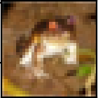
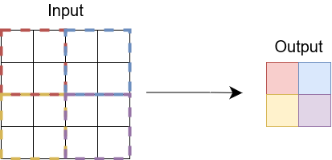

======================================================
Evrişimli sinir ağları (Convolutional neural networks)
======================================================

.. We will create a convolutional neural network that we will use to carry out classification on image data. Convolutional neural networks are great for working with data that has more than one dimension, for example, 2D images. In this example we use convolutional layers and pooling layers to processes images in a manner that respects their dimensionality. 

Bu bölümde görüntü verileri üzerinde sınıflandırma yapmak için kullanacağımız evrişimsel bir sinir ağı oluşturacağız. 
Evrişimli sinir ağları, örneğin iki boyutlu görüntüler gibi birden fazla boyutu olan verilerle çalışmak için mükemmeldir. 
Bu örnekte, görüntüleri boyutsallıklarına saygı gösterecek şekilde işlemek için evrişimli katmanları ve 
havuz katmanlarını kullanıyoruz.

Veri kümesi
=====================

.. We will use CIFAR10 image dataset containing 60000 images of 10 different objects. The dataset is provided in the ``torchvision`` library. The dataset contains `PIL images <https://pillow.readthedocs.io/en/stable/reference/Image.html>`_ which we cannot use directly with PyTorch layers. So, we use the ``ToTensor()`` transformation to convert the images into tensors. This will convert each pixel in the image into a tensor of three numbers in the range [0,1] representing the RGB values of that pixel. We also apply a second transform, ``Normalize()`` to make shift the values to the range [-0.5, 0.5].

10 farklı nesnenin 60000 görüntüsünü içeren CIFAR10 görüntü veri kümesini kullanacağız. 
Veri setini, torchvision kitaplığından indireceğiz. Veri kümesi, doğrudan PyTorch katmanlarıyla kullanamadığımız 
PIL görüntülerini içerir. Bu nedenle, görüntüleri tensörlere dönüştürmek için ``ToTensor()`` dönüşümünü kullanıyoruz. 
Bu, görüntüdeki her pikseli, o pikselin RGB değerlerini temsil eden [0,1] aralığında üç sayıdan oluşan bir tensöre dönüştürecektir. 
Ayrıca değerleri [-0.5, 0.5] aralığına kaydırmak için ``Normalize()`` adlı ikinci bir dönüşüm uygulayacağız.

.. code-block:: python

   import torchvision
   import torchvision.transforms as transforms
   
   # veriler dönüştürülmeden yüklenecek. Görüntü nesneleri şeklinde olacak. 
   train_dataset = torchvision.datasets.CIFAR10(root='./data', train=True,
                                           download=True)

   first_element = train_dataset[0]
   image, label = first_element
   print("Verinin değişimden önceki şekli")
   print(type(image), image)

   # İki dönüşümü uygulayacak tek bir dönüşüm oluşturun:
   # 1. ToTensor(): Her görüntüdeki her pikseli RGB değerleri için üç 
   #                sayıdan oluşan bir tensöre dönüştürün.
   # 2. Normalize(): değerleri [0,1] aralığından [-0.5, 0.5] değerine kaydırır 
   transform = transforms.Compose(
       [transforms.ToTensor(),
        transforms.Normalize((0.5, 0.5, 0.5), (0.5, 0.5, 0.5))])

   # veriler yüklenir ve dönüşümler uygulanır 
   train_dataset = torchvision.datasets.CIFAR10(root='./data', train=True,
                                           download=True, transform=transform)

   test_dataset = torchvision.datasets.CIFAR10(root='./data', train=False,
                                          download=True, transform=transform)

   first_element = train_dataset[0]
   image, label = first_element
   print(type(image), image.shape)
   print("Her görüntü 32x32 pikseldir ve her pikselin üç değeri vardır")

   import matplotlib.pyplot as plt
   import numpy as np

   # Bu işlev, tensör temsilini kullanarak görüntüyü gösterecektir. 
   def imshow(img):
       img = img / 2 + 0.5  # unnormalize
       npimg = img.numpy()
       plt.imshow(np.transpose(npimg, (1, 2, 0)))
       plt.show()

   print("İlk görüntü bir kurbağa görüntüsü!")
   imshow(image)

.. admonition:: Çıktı
   :class: dropdown, information

   .. code-block:: bash

      Verinin değişimden önceki şekli
      <class 'PIL.Image.Image'> <PIL.Image.Image image mode=RGB size=32x32 at 0x29F41017130>
      <class 'torch.Tensor'> torch.Size([3, 32, 32])
      Her görüntü 32x32 pikseldir ve her pikselin üç değeri vardır

Veri yükleyiciler (Dataloaders)
-------------------------------

.. We create data loaders for the datasets that we will use during the training and testing loops to fetch data.

Eğitim ve test döngüleri sırasında kullanacağımız veri kümelerini taşıyabilmek için veri yükleyicileri oluşturuyoruz.

.. code-block:: python

   import torch

   # her parti 4 görüntüden oluşacaktır 
   batch_size = 4

   # veri yükleyici örnekleri karıştıracak 
   train_loader = torch.utils.data.DataLoader(train_dataset, batch_size=batch_size,
                                             shuffle=True)

   test_loader = torch.utils.data.DataLoader(test_dataset, batch_size=batch_size,
                                            shuffle=False)

   dataiter = iter(train_loader)
   images, labels = dataiter.next()
   print(images.shape)

.. admonition:: Çıktı
   :class: dropdown, information

   .. code-block:: python

      torch.Size([4, 3, 32, 32])

Evrişimli sinir ağı modeli
===============================================================

.. Our model is going to take the image data tensors and process them through convolutional layers and pooling layers. Afterwards, we will take the data through linear layers to finally acquire scores for the classes we would like to predict from. First we will demonstrate the convolutional layer as well as the pooling layer, then, we will build the complete neural network model by inheriting from the ``torch.nn.Module`` class.

Modelimiz, görüntü veri tensörlerini alacak ve bunları evrişim katmanları ve havuz katmanları aracılığıyla işleyecektir. 
Daha sonra, tahmin etmek istediğimiz sınıflar için verileri doğrusal katmanlardan alacağız ve son skorları elde edeceğiz. 
Bu bölümde, önce evrişim katmanını ve havuzlama katmanını göstereceğiz, ardından ``torch.nn.Module`` sınıfından miras alarak 
tam sinir ağı modelini oluşturacağız.

Evrişimsel katmanlar
-------------------------------------------

.. Convolutional layers take multi-dimensional data and use a convolution to produce a multi-dimensional output. The example below demonstrates the first convolutional layer we will use in our model. However, in the example below, we use an input image of the dimensions 9x9 instead of 32x32 for clarity. The layer trains a 5x5 filter that will go over each group of 5x5 pixels in the image and transform them into a single pixel in the output. In addition, the filter will use the three colours (channels) of each pixel in the input and produce 6 output channels for each pixel in the output.

Evrişimsel katmanlar çok boyutlu verileri alır ve çok boyutlu bir çıktı üretmek için bir evrişim kullanır. 
Aşağıdaki örnek, modelimizde kullanacağımız ilk evrişimsel katmanı göstermektedir. Ancak, aşağıdaki örnekte, 
netlik için 32x32 yerine 9x9 boyutlarında bir giriş görüntüsü kullanıyoruz. Katman, görüntüdeki her 5x5 piksel 
grubunun üzerinden geçerek ve bunları çıktıda tek bir piksele dönüştürerek 5x5'lik bir filtre eğitir. Ayrıca filtre, 
girişteki her pikselin üç rengini (kanalını) kullanacak ve çıktıdaki her piksel için 6 çıkış kanalı üretecektir.

.. image:: ../../assets/pytorch-education/conv.png
   :target: ../../assets/pytorch-education/conv.png
   :alt: ../../assets/pytorch-education/conv.png

.. Belows is a demonstration of what the convolutional layer does to an input. We pass a batch of four images to the layer and receive a transformed output:

Aşağıda, evrişim katmanının bir girdiye ne yaptığının bir gösterimi verilmiştir. Katmana dört görüntüden oluşan bir toplu 
iş gönderiyoruz ve dönüştürülmüş bir çıktı alıyoruz:

.. code-block:: python

   import torch.nn as nn

   conv1 = nn.Conv2d(in_channels=3, out_channels=6, kernel_size=5)
   # input_channels = her giriş pikselindeki kanal sayısı
   # output_channels = her çıkış pikselindeki kanal sayısı
   # kernel_size = filtrenin genişliği ve yüksekliği

   dataiter = iter(train_loader)
   images, labels = dataiter.next()
   print(f"katmandan önce, şekil: {images.shape}")
   output = conv1(images)
   print(f"katmandan sonra, şekil: {output.shape}")

.. admonition:: Çıktı
   :class: dropdown, information

   .. code-block:: python

      katmandan önce, şekil: torch.Size([4, 3, 32, 32])
      katmandan sonra, şekil: torch.Size([4, 6, 28, 28])

Havuz katmanları (Pooling layers)
---------------------------------

.. After running convolution layers, we can use pooling layers to compress the output into a smaller representation. In our model, we use a max-pool that will take the output of the previous layer and compress it using the maximum function. Below is an example of a pooling layer. 

Evrişim katmanlarını çalıştırdıktan sonra, çıktıyı daha küçük bir temsile sıkıştırmak için havuz katmanlarını kullanabiliriz.
Modelimizde, bir önceki katmanın çıktısını alacak ve maksimum fonksiyonunu kullanarak sıkıştıracak bir max-pool kullanıyoruz. 
Aşağıda bir havuzlama katmanı örneği verilmiştir.

.. Below, we demonstrate a max-pool layer that will take the output of the previous convolutional layer and apply pooling. The layer will take grids of 2x2 and find their maximum value. The pooling layer has a stride of 2 so the filter will move 2 locations at a time. This pooling procedure happens for all the channels of the input.

Aşağıda, önceki evrişim katmanının çıktısını alacak ve havuzlama uygulayacak bir maksimum havuz katmanı gösteriyoruz. 
Katman 2x2'lik ızgaralar alacak ve maksimum değerlerini bulacaktır. Havuzlama katmanının adımı 2'dir, bu nedenle filtre 
bir seferde 2 konum hareket edecektir. Bu havuzlama prosedürü, girişin tüm kanalları için gerçekleşir.

.. code-block:: python

   pool = nn.MaxPool2d(kernel_size=2,stride=2)
   # kernel_size = filtrenin genişliği ve yüksekliği 
   # stride = filtreleme işlemleri arasındaki mesafe 

   print(f"katmandan önce, şekil: {output.shape}")
   output = pool(output)
   print(f"katmandan sonra, şekil: {output.shape}")

.. admonition:: Çıktı
   :class: dropdown, information

   .. code-block:: python

      katmandan önce, şekil: torch.Size([4, 6, 28, 28])
      katmandan sonra, şekil: torch.Size([4, 6, 14, 14])

Tam model
--------------------------

.. We create our model by inheriting from the the ``torch.nn.Module`` class. We define two convolutional layers and a single pooling function that we will use after each convolutional layer. We also define three linear layers that will take the output of convolution and gradually transform it until there are only 10 outputs which is the number of classes to predict.

``torch.nn.Module`` sınıfından miras alarak modelimizi oluşturuyoruz. Her evrişim katmanından sonra kullanacağımız iki 
evrişim katmanı ve tek bir havuz işlevi tanımlıyoruz. Ayrıca, evrişimin çıktısını alacak ve tahmin edilecek sınıf sayısı 
olan sadece 10 çıktı olana kadar kademeli olarak dönüştürecek üç doğrusal katman tanımlıyoruz.

.. code-block:: python

   import torch.nn.functional as F

   class CNN(nn.Module):
       def __init__(self):
           super(CNN, self).__init__()
           # ilk evrişim 5x5 boyutlarında bir filtre kullanır, piksel başına 3 giriş 
           # kanalı alır ve 6 çıkış kanalı üretir 
           self.conv1 = nn.Conv2d(3, 6, 5)
           # 2x2 ızgaralı ve 2 adımlı max-pool kullanıyoruz. Havuz eğitilmediğinden, 
           # yalnızca bir örneğine ihtiyacımız var 
           self.pool1and2 = nn.MaxPool2d(2, 2)
           # İkinci evrişim 5x5 boyutlarında bir filtre kullanır, ancak 6 giriş kanalı alır
           # ve konum başına 16 çıkış kanalı üretir
           self.conv2 = nn.Conv2d(6, 16, 5)

           # Bu doğrusal katman, üzerine self.pool1and2 uygulandıktan sonra conv2'nin çıktısını 
           # alacaktır, bu da girdinin 16*5*5 değerine sahip olacağı anlamına gelir. 
           self.fc1 = nn.Linear(16 * 5 * 5, 120)
           self.fc2 = nn.Linear(120, 84)
         
           # Son doğrusal katman, tahmin edilecek 10 sınıf olduğundan 10 çıktı üretmelidir. 
           self.fc3 = nn.Linear(84, 10)

       def forward(self, x):
           # x -> [batch_size, 3, 32, 32]
           output = self.conv1(x) # [batch_size, 6, 28, 28]
           output = self.pool1and2(output) # [batch_size, 6, 14, 14]
           output = F.relu(output) # [batch_size, 6, 14, 14]
           output = self.conv2(output) # [batch_size, 16, 10, 10]
           output = self.pool1and2(output) # [batch_size, 16, 5, 5]
           output = F.relu(output) # [batch_size, 16, 5, 5]
           # Doğrusal katmana beslemek için çıktıyı girdi başına tek bir satır haline getirmeliyiz. 
           output = output.reshape(-1, 16 * 5 * 5) # [batch_size, 16*5*5]
           output = F.relu(self.fc1(output))
           output = F.relu(self.fc2(output))
           # Son katmandan sonra bir aktivasyon kullanmayacağız çünkü
           # kayıp işlevi sigmoid aktivasyonunu otomatik olarak uygulayacaktır
           output = self.fc3(output)
           return output

   device = torch.device('cuda' if torch.cuda.is_available() else 'cpu')

   model = CNN().to(device)

   print(model)

.. admonition:: Çıktı
   :class: dropdown, information

   .. code-block:: python

      CNN(
      (conv1): Conv2d(3, 6, kernel_size=(5, 5), stride=(1, 1))
      (pool1and2): MaxPool2d(kernel_size=2, stride=2, padding=0, dilation=1, ceil_mode=False)
      (conv2): Conv2d(6, 16, kernel_size=(5, 5), stride=(1, 1))
      (fc1): Linear(in_features=400, out_features=120, bias=True)
      (fc2): Linear(in_features=120, out_features=84, bias=True)
      (fc3): Linear(in_features=84, out_features=10, bias=True)
      )

Optimize edici ve kayıp
============================================

.. We define the optimizer and loss functions that will be used for training the model.

Modeli eğitmek için kullanılacak optimize edici ve kayıp fonksiyonlarını tanımlıyoruz.

.. code-block:: python

   learning_rate = 0.001
   criterion = nn.CrossEntropyLoss()
   optimizer = torch.optim.SGD(model.parameters(), lr=learning_rate)

Eğitim döngüsü
==============================

.. Training the model will use the train loader, which is going to generate batches of images of size ``batch_size=4`` . For each training epochs, all the training batches will be used for training the model. For each batch, a forward propagation through the system will be carried out, then a backward propagation to optimize it. Before processing the data, we move it to the device.

Modeli eğitmek, ``batch_size=4`` değeri ile görüntü yığınları oluşturacak olan eğitim seti yükleyiciyi kullanacaktır. 
Her eğitim dönemi için, modelin eğitiminde tüm eğitim grupları kullanılacaktır. Her parti için, sistem boyunca ileriye 
doğru bir yayılım, ardından onu optimize etmek için geriye doğru bir yayılım gerçekleştirilecektir. Verileri işlemeden 
önce cihaza taşıyoruz.

.. code-block:: python

   num_epochs = 5

   # Train_loader'daki parti sayısı 
   n_total_steps = len(train_loader)
   for epoch in range(num_epochs):

       # Her toplu iş, bir görüntü tensörü ve bu görüntünün etiketlerini içeren 
       # bir tensörden oluşur. 
       for i, (images, labels) in enumerate(train_loader):
           images = images.to(device)
           labels = labels.to(device)

           # Giriş tensörü şu şekildedir: [batch_size, 3, 32, 32]
           outputs = model(images)

           loss = criterion(outputs, labels)

           optimizer.zero_grad()
           loss.backward()
           optimizer.step()

           if (i+1) % 2000 == 0:
               print (f'Epoch [{epoch+1}/{num_epochs}], Step [{i+1}/{n_total_steps}], Loss: {loss.item():.4f}')

.. admonition:: Çıktı
   :class: dropdown, information

   .. code-block::

      Epoch [1/5], Step [2000/12500], Loss: 2.3247
      Epoch [1/5], Step [4000/12500], Loss: 2.3011
      Epoch [1/5], Step [6000/12500], Loss: 2.3187
      Epoch [1/5], Step [8000/12500], Loss: 2.2360
      Epoch [1/5], Step [10000/12500], Loss: 2.3910
      Epoch [1/5], Step [12000/12500], Loss: 2.0308
      Epoch [2/5], Step [2000/12500], Loss: 1.4436
      Epoch [2/5], Step [4000/12500], Loss: 2.0996
      Epoch [2/5], Step [6000/12500], Loss: 2.1182
      Epoch [2/5], Step [8000/12500], Loss: 1.8409
      Epoch [2/5], Step [10000/12500], Loss: 2.2138
      Epoch [2/5], Step [12000/12500], Loss: 0.8254
      Epoch [3/5], Step [2000/12500], Loss: 1.8962
      Epoch [3/5], Step [4000/12500], Loss: 1.1463
      Epoch [3/5], Step [6000/12500], Loss: 1.5816
      Epoch [3/5], Step [8000/12500], Loss: 1.1057
      Epoch [3/5], Step [10000/12500], Loss: 1.2237
      Epoch [3/5], Step [12000/12500], Loss: 2.3894
      Epoch [4/5], Step [2000/12500], Loss: 1.1736
      Epoch [4/5], Step [4000/12500], Loss: 1.8377
      Epoch [4/5], Step [6000/12500], Loss: 1.8938
      Epoch [4/5], Step [8000/12500], Loss: 1.6018
      Epoch [4/5], Step [10000/12500], Loss: 1.0369
      Epoch [4/5], Step [12000/12500], Loss: 1.3495
      Epoch [5/5], Step [2000/12500], Loss: 1.0014
      Epoch [5/5], Step [4000/12500], Loss: 1.1602
      Epoch [5/5], Step [6000/12500], Loss: 1.0183
      Epoch [5/5], Step [8000/12500], Loss: 1.2231
      Epoch [5/5], Step [10000/12500], Loss: 1.8884
      Epoch [5/5], Step [12000/12500], Loss: 0.8248

Değerlendirme
==========================

Son olarak, test verilerini kullanarak eğitilen modeli değerlendireceğiz. 
Test verisi yığınları oluşturacak test yükleyicisini kullanıyoruz. On sınıfın her birinin doğruluğunu ve ayrıca 
sistemin genel doğruluğunu hesaplıyoruz. Değerlendirmede kullanılan hesaplamanın, hesaplama ve bellek açısından daha 
verimli olması için, yani hesaplama grafiği oluşturmaması için değerlendirme kodunu ``torch.no_grad()`` işlemiyle çevreliyoruz.

.. code-block:: python

   classes = ('plane', 'car', 'bird', 'cat',
              'deer', 'dog', 'frog', 'horse', 'ship', 'truck')
   with torch.no_grad():
       n_correct = 0
       n_samples = 0
       n_class_correct = [0 for i in range(10)]
       n_class_samples = [0 for i in range(10)]
       for images, labels in test_loader:
           images = images.to(device)
           labels = labels.to(device)
           outputs = model(images)

           _, predicted = torch.max(outputs, 1)
           n_samples += labels.size(0)
           n_correct += (predicted == labels).sum().item()

           for i in range(batch_size):
               label = labels[i]
               pred = predicted[i]
               if (label == pred):
                   n_class_correct[label] += 1
               n_class_samples[label] += 1

       acc = 100.0 * n_correct / n_samples
       print(f'Ağın doğruluğu: {acc} %')

       for i in range(10):
           acc = 100.0 * n_class_correct[i] / n_class_samples[i]
           print(f'{classes[i]} doğruluğu: {acc} %')

.. admonition:: Çıktı
   :class: dropdown, information

   .. code-block::
   
      Ağın doğruluğu: 49.98 %
      plane doğruluğu: 32.0 %
      car doğruluğu: 71.6 %
      bird doğruluğu: 30.8 %
      cat doğruluğu: 27.1 %
      deer doğruluğu: 37.4 %
      dog doğruluğu: 45.0 %
      frog doğruluğu: 71.9 %
      horse doğruluğu: 55.9 %
      ship doğruluğu: 65.4 %
      struck doğruluğu: 62.7 %
   