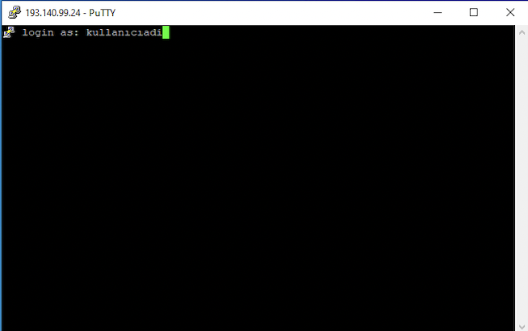

=========================================================================================
Windows İşletim Sistemi için Putty Uygulaması Kurulumu ve Truba Bilgisayarlarına Bağlanma
=========================================================================================

PuTTY, orijinal olarak Windows platformu için açık kaynak bir SSH istemcisidir. Bu uygulamayı bilgisayarınıza indirmek, kurmak ve sonrasında **ssh protokolü** ile bağlanabilmek için aşağıdaki adımları izleyiniz.

**1.**
Kaynak kodunu bilgisayarınıza https://www.putty.org/ adresinden bilgisayarınıza uygun olan verisyonu seçip indirebilirsiniz.

 .. image:: putty-1.png
   :width: 2000

 

 .. image:: putty-2.png   
   :width: 1000

 **2.**  

``.msi`` uzantılı dosyayı kurmak için çift tıklayarak izlerleyiniz. Aşağıdaki fügürler sizlere adımlarda yardımcı olacaktır.

 
 .. image:: putty-3.png   
    :width: 2000

 .. image:: putty-4.png  
    :width: 1000  

**3.**

Bilgisayarınıza uygulamayı yükledikten sonra açıp, Truba bilgisyarlarına bağlanmak için ``Host Name`` (or Ip address) ``inet`` adresini giriniz. **(193.140.99.24)**
Aşağıdaki şekilde  gösterilmiştir.

  .. image:: putty-5.png  
    :width: 1000  

  .. image:: putty-6.png  
    :width: 1000 

**4.**
Ip adresini girdiğinizde kullanıcı adını ve şifrenizi gireceğiniz bir terminal gelecektir. Truba tarafından sizlere verilken kullanıcı adı ve şifreyle giriş yapabilirsiniz.

