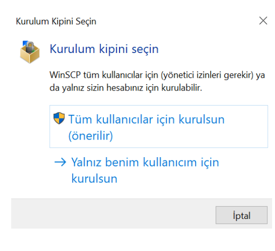
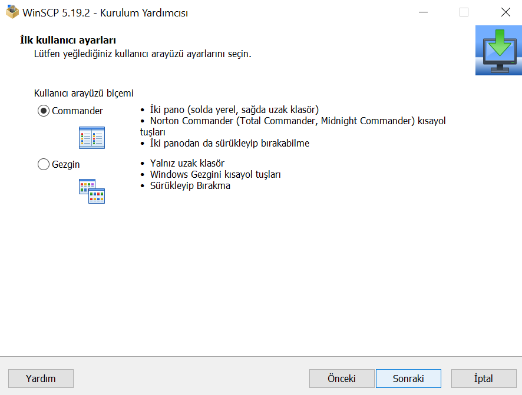
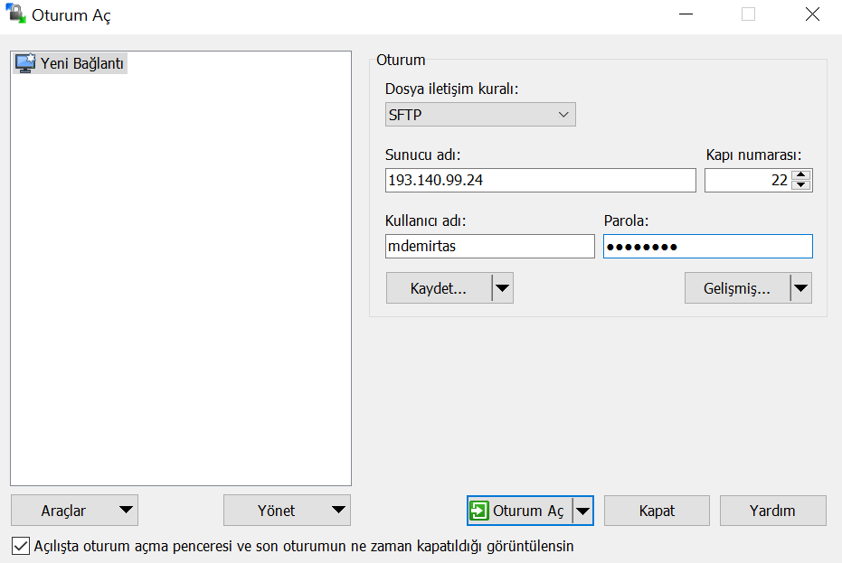
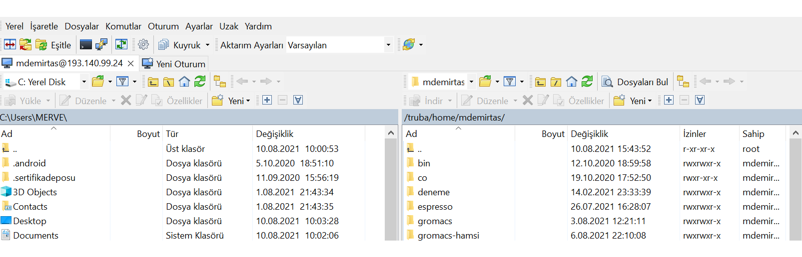
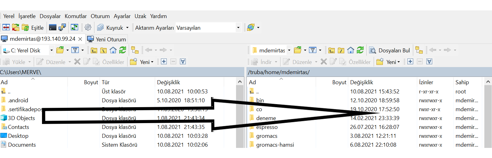

=====================================================================================================
Winscp Uygulaması Kurulumu ve Truba ve Lokal Bilgisayarlar Arasında Dosya Transferi
=====================================================================================================

Winscp uygulaması, Windows platformu için dosya aktarım protokollerini kullanarak yerel bir bilgisayar ile uzak sunucular arasında dosya kopyalamanıza yardımcı olur. Bu uygulamayı bilgisayarınıza indirmek, kurmak ve sonrasında dosyalarınızı transferleri için aşağıdaki adımları izleyiniz.

**1.**
Kaynak kodunu bilgisayarınıza https://winscp.net/eng/index.php adresinden bilgisayarınıza **Download Now** kısmına tıklayarak indiriniz.

 .. image:: winscp-1.png
   :width: 800

**2.**
``.exe`` uzantılı dosyayı bilgisyarınıza yüklemek için resimlerde verilen adımları izleyiniz. ``.exe`` dosyasının bilgisayarınızda değişiklik yapmasına izin verdikten sonra **tüm kullanıcılar için kurulsun** kipini seçiniz. 

.. image:: winscp-3.png
   :width: 200

Sonrasında **lisans Anlaşmasını** onaylayınız. Bir sonraki menüde 
**kurulum Tipi** sizi karşılayacaktır. Önerilen **Tipik Kurulum** seçeneğini işaretleyiniz.

.. image:: winscp-4.png
   :width: 300

Bir sonraki adımda **İlk Kullanıcı Ayarları** bizi karşılayacaktır. Kullanım kolaylığı açısından ``Commander`` ile tutorial devam edecektir. Sizler isterseniz diğer seçenek ile devam edebilirsiniz.

 Her türlü ayarlamayı tamamladıktan sonra ``Kur`` sekmesine tıklayarak bu uygulamayı bilgisayarımıza yüklemiş olacağız.  

 .. image:: winscp-6.png
   :width: 300

**3.**
Bu adımda yüklemiş olduğumuz **Winscp** uygulamasıyla nasıl dosya transferi yapılacağını göstereceğiz. Uygulamayı açtıktan sonra aşağıdaki şekilde gösterildiği gibi sizi **oturum aç** menüsü
karşılayacaktır. Sunucu adı (193.140.99.24) ve size verilen kullanıcı adı ve şifrenizi girdikten sonra oturum açabilirsiniz. 

Oturum açılınca sizi iki taraflı bir sayfa karşılayacaktır. Bu sayfanın sol tarafında kendi lokal bilgisyarınızdaki dizinler, sağ tarafında ise TRUBA' da size sağlanan ev dizini ve klasörler mevcuttur.
Herhangi bir taraftan diğer bir tarafa dosya transferi yapmak için  dosyaları bir taraftan diğer tarafa mause ya da touch pad yardımıyla sürükleyip yapabilirsiniz.  Ayrıca yukarıdaki menü yardımıyla dosyalarınızı silebilir ve tekrardan düzenleyebilirsiniz (Yeniden dosya oluşturma).

 

