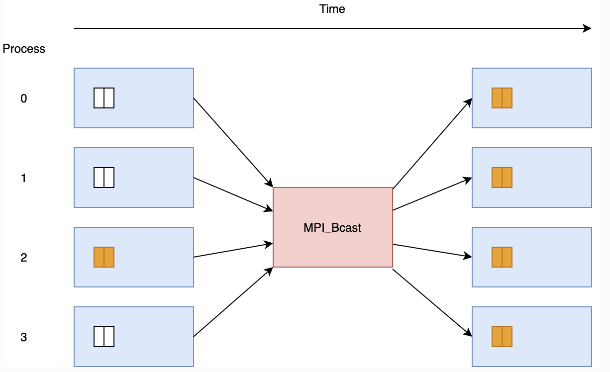
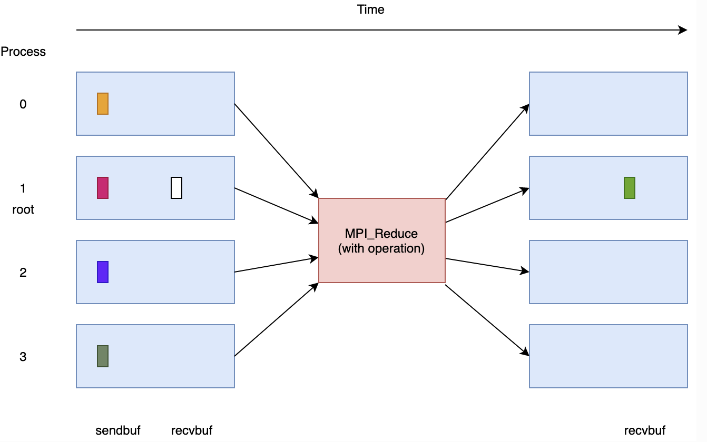

Toplu İşlemler
==============

Şu ana kadar işlemciler arasındaki iletişimden bahsettik. Fakat toplu iletişim yaparken bütün işlemcilerin birbiriyle konuşması gerekmez. MPI standardı bu özel durumların bir çoğunu desteklemektedir. Bu durumlar:

* Senkronizasyon

  * Bütün işlemciler aynı noktaya erişene kadar beklemeyi içerir.
  * OpenMPI standardında ``MPI_Barrier`` fonksiyonu ile uyarlanmıştır.
  * Hata ayıklamak için özellikle faydalıdır.

* Tek işlemciden bütün işlemcilere

  * Bir sıra diğer bütün sıralara mesaj yollar.
  * OpenMPI standardında ``MPI_Bcast`` ve ``MPI_Scatter`` fonksiyonları ile uyarlanmıştır.

* Bütün işlemcilerden tek bir işlemciye

  * Bütün sıralar tek bir sıraya mesaj yollar.
  * OpenMPI standardında ``MPI_Reduce`` ve ``MPI_Gather`` fonksiyonları ile uyarlanmıştır.

* Bütün işlemcilerden bütün işlemcilere

  * Bütün sıralar hem mesaj yollar hem de mesaj alır.
  * OpenMPI standardında ``MPI_Alltoall`` ve ``MPI_Allgather`` fonksiyonları ile uyarlanmıştır.
  * Bütün işlemcileri içeren indirgemeler önemli bir özel durumdur. Bu durum da ``MPI_Allreduce``  fonksiyonu ile uyarlanmıştır.

Bu iletişim şekillerinin hepsi noktadan noktaya mesajlarla yapılabilir. Ancak bu, daha fazla kod gerektirir, daha yavaş çalışır ve optimize edilmiş toplu çağrıları kullanmaktan daha kötü ölçeklenir.

Barrier
-------

.. code-block:: c

   int MPI_Barrier( MPI_Comm communicator )

**communicator:**  programlar arası iletişimi sağlayan obje

.. image:: assets/barrier.png
   :target: assets/barrier.png
   :alt: assets/barrier.png

Bu komut parametre olarak verilen MPI_Comm objesine dahil edilmiş bütün sıralar ``MPI_Barrier`` komutunda senkron olana kadar işlemini önce tamamlayan sıraları bekletir. Böylece bütün sıralar senkronize olmuş olur.

Broadcast
---------

.. code-block:: c

   int MPI_Bcast(
       void* data,
       int count,
       MPI_Datatype datatype,
       int root,
       MPI_Comm communicator)

``MPI_Send``\ 'e çok benzer, ancak aynı veriler bir sıradan diğer tüm sıralara gönderilir. Bu işlev ancak tüm süreçler ``MPI_Bcast`` fonksiyonuna ulaştığında geri döner, yani bir bariyer teşkil etmektedir (\ ``MPI_Barrier``\ ).

Scatter
-------

.. code-block:: c

   int MPI_Scatter(
       void* sendbuf,
       int sendcount,
       MPI_Datatype sendtype,
       void* recvbuffer,
       int recvcount,
       MPI_Datatype recvtype,
       int root,
       MPI_Comm communicator)

Sıra kökündeki ``sendbuf``\ 'taki veriler parçalara bölünür ve her parça farklı bir sıraya gönderilir. Her yığın, ``sendtype`` türünden ``sendcount`` kadar eleman içerir. Yani ``sendtype`` ``MPI_Int`` ve ``sendcount`` 2 ise, her sıra 2 tamsayı alacaktır. Alınan veriler ``recvbuf``\ 'a yazılır. Mesaj sadece kök tarafından gönderilir. Bu nedenle ``sendbuf``\ 'a yalnızca kök tarafından ihtiyaç duyulur. Sonraki iki parametre, ``recvcount`` ve ``recvtype``\ , alma arabelleğini tanımlar. Genellikle ``recvtype`` ``sendtype`` ile aynıdır ve ``recvcount`` ``Nranks*sendcount``\ 'tur. Burada ``Nranks`` ``communicator`` 'a tanımlanmış sıra sayısını belirtir.

.. image:: assets/scatter.png
   :target: assets/scatter.png
   :alt: assets/scatter.png

Gather
------

.. code-block:: c

   int MPI_Gather(
       void* sendbuf,
       int sendcount,
       MPI_Datatype sendtype,
       void* recvbuffer,
       int sendcount,
       MPI_Datatype recvtype,
       int root,
       MPI_Comm communicator)

``Gather`` operasyonu ``Scatter`` operasyonun tersi olarak düşünülebilir. Her sıra, ``sendbuf``\ 'taki verileri sıralama köküne gönderir. Kök, sıra numaralarına göre verileri ``recvbuffer``\ 'a toplar.

.. image:: assets/gather.png
   :target: assets/gather.png
   :alt: assets/gather.png

Reduce
------

.. code-block:: c

   int MPI_Reduce(
       void* sendbuf,
       void* recvbuffer,
       int count,
       MPI_Datatype datatype,
       MPI_Op op,
       int root,
       MPI_Comm communicator)

``MPI_Reduce`` program akışını durdurur (\ ``MPI_Barrier`` gibi) ve programa toplu senkronizasyon getirir. Çağrıdan sonra, kök sıra, communicator'a dahil olan bütün sıralardaki değerlerin bir işleme göre toplaşmış değerini elde eder.

MPI standardında aritmetik ve mantıksal işlemler dahil olmak üzere önceden tanımlanmış birkaç işlem türü vardır. Bunlardan bazıları:

* ``MPI_SUM``\ : değerlerin toplamları
* ``MPI_MAX``\ : maximum değer
* ``MPI_MIN``\ : minimum değer
* ``MPI_PROD``\ : değerlerin çarpımları
* ``MPI_MAXLOC``\ : maximum değer ve bu değeri gönderen sıra
* ``MPI_MINLOC``\ : minimum değer ve bu değeri gönderen sıra

``MPI_Reduce`` işlemi genellikle diğer basit MPI fonksiyonlarını kullanarak oluşturabileceğiniz manuel iletişimden daha hızlıdır. Bunun sebebi çalıştığı sistemin topolojik yapısına bağlı olarak farklı algoritmalar uygulayabilir. Bu, özellikle, ``MPI_Reduce`` işlemlerinin, hesaplama yapmak için herhangi bir sırayı kullanmadan, yolda indirgemeler gerçekleştirmek için iletişim cihazlarını kullanabildiği, yüksek performanslı bilgi işlem için tasarlanmış sistemlerde geçerlidir. Bu sistemlerin nasıl inşa edildiğini Sanal Topolojiler adlı derste daha detaylı inceleyeceğiz.

Allreduce
---------

.. code-block:: c

   int MPI_Allreduce(
        void* sendbuf,
        void* recvbuffer,
        int count,
        MPI_Datatype datatype,
        MPI_Op op,
        MPI_Comm communicator)

``MPI_Allreduce``\ , temelde ``MPI_Reduce`` ile aynı işlemleri gerçekleştirir, ancak sonuç tüm sıralara gönderilir.

Scatter - Gather Örnek
----------------------

.. code-block:: c

   #include "mpi.h"
   #include <stdio.h>

   int main(int argc, char **argv)
   {
       /* mpi programını başlatmak için Init fonksiyonunu çağırıyoruz */
       MPI_Init(&argc, &argv);
       MPI_Comm comm = MPI_COMM_WORLD;
       int rank, size;
       MPI_Comm_rank(comm, &rank);
       MPI_Comm_size(comm, &size);

       /* işlemcilere dağıtılacak değerleri tanımlıyoruz
                bu örnekte initial_values adlı listedeki 4 değeri 4 farklı işlemciye
                dağıtıyoruz. 
                Slurm scriptinizde 4 farklı node ve her node da 1 process ayırabilirsiniz.
                4ten fazla process tanımladığınız takdirde program çökecektir.
           */
       float initial_values[4] = { 100, -1000, 3.5, -2.25 };
       float values_to_scatter[4];
       const int rank_of_scatter_root = 0;
       if (rank == rank_of_scatter_root)
       {
           values_to_scatter[0] = initial_values[0];
           values_to_scatter[1] = initial_values[1];
           values_to_scatter[2] = initial_values[2];
           values_to_scatter[3] = initial_values[3];
       }

       /* dağıtım öncesi durumu çıktılıyoruz */
       printf("On rank %d, pre-scatter values were [%f, %f, %f, %f]\n", rank,
               values_to_scatter[0],
               values_to_scatter[1],
               values_to_scatter[2],
               values_to_scatter[3]);

       /* dağıtım işlemini gerçekleştiriyoruz */
       float scattered_value;
       MPI_Scatter(values_to_scatter, 1, MPI_FLOAT,
                   &scattered_value, 1, MPI_FLOAT,
                   rank_of_scatter_root, comm);

       /* dağıtım sonrası durumu çıktılıyoruz */
       printf("On rank %d, scattered value was %f\n", rank, scattered_value);

       /* temsili olarak dağıtılmış değer üzerinde bir işlem gerçekleştiriyoruz */
       float result = scattered_value * (rank + 1);

       /* yeni kök sıraya işlenmiş değerlerin bütün sırlardan topluyoruz */
       float gathered_values[4];
       const int rank_of_gather_root = 2;
       MPI_Gather(&result, 1, MPI_FLOAT,
                  gathered_values, 1, MPI_FLOAT,
                  rank_of_gather_root, comm);

       /* toplama işlemi sonrası durumu çıktılıyoruz */
       if (rank == rank_of_gather_root)
       {
           printf("On rank %d, gathered values were [%f, %f, %f, %f]\n", rank,
                   gathered_values[0],
                   gathered_values[1],
                   gathered_values[2],
                   gathered_values[3]);
       }

       /* yapılan işlemlerin ve kodun doğruluğunu kontrol ediyoruz */
       int success = (result == initial_values[rank] * (rank + 1));

       /* gather işlemleminin ve kodun doğruluğunu kontrol ediyoruz */
       if (rank == rank_of_gather_root)
       {
           success = success && ((gathered_values[0] == initial_values[0] * 1) &&
                                 (gathered_values[1] == initial_values[1] * 2) &&
                                 (gathered_values[2] == initial_values[2] * 3) &&
                                 (gathered_values[3] == initial_values[3] * 4));
       }
       if (success)
       {
           printf("SUCCESS on rank %d!\n", rank);
       }
       else
       {
           printf("Improvement needed before rank %d can report success!\n", rank);
       }

       /* MPI ortamını temizliyoruz */
       MPI_Finalize();
       return 0;
   }

Broadcast - Reduce Örnek
------------------------

.. code-block:: c

   #include "mpi.h"
   #include <stdio.h>

   int main(int argc, char **argv)
   {
       /* mpi programını başlatmak için Init fonksiyonunu çağırıyoruz */
       MPI_Init(&argc, &argv);
       MPI_Comm comm = MPI_COMM_WORLD;
       int rank, size;
       MPI_Comm_rank(comm, &rank);
       MPI_Comm_size(comm, &size);

       /* Saçılcak değerleri hazırlıyoruz */
       int expected_values[2] = { 100, -1000 };
       int values_to_broadcast[2];
       const int rank_of_root = 0;
       if (rank == rank_of_root)
       {
           values_to_broadcast[0] = expected_values[0];
           values_to_broadcast[1] = expected_values[1];
       }

       /* saçılma öncesi durumu çıktılıyoruz */
       printf("On rank %d, pre-broadcast values were [%d, %d]\n", rank,
               values_to_broadcast[0],
               values_to_broadcast[1]);

       /* saçılma işlemini gerçekleştiriyoruz */
       MPI_Bcast(values_to_broadcast, 2, MPI_INT, rank_of_root, comm);

       /* saçılma sonrası durumu çıktılıyoruz */
       printf("On rank %d, broadcast values were [%d, %d]\n", rank,
               values_to_broadcast[0],
               values_to_broadcast[1]);

       /* toplama işlemi kullanarak saçılan değerleri 
                bütün sıralar üzerinden indirgiyoruz */
       int reduced_values[2];
       MPI_Reduce(values_to_broadcast, reduced_values, 2, MPI_INT,
                  MPI_SUM, rank_of_root, comm);

       /* indirgeme sonrası durumu çıktılıyoruz */
       printf("On rank %d, reduced values were [%d, %d]\n", rank,
               reduced_values[0],
               reduced_values[1]);

       /* yapılan işlemlerin ve kodun doğruluğunu kontrol ediyoruz */
       int success = ((values_to_broadcast[0] == expected_values[0]) &&
                      (values_to_broadcast[1] == expected_values[1]));

       /* indirgeme işlemenin doğruluğunu kontrol ediyoruz */
       if (rank == rank_of_root)
       {
           success = success && ((reduced_values[0] == expected_values[0] * size) &&
                                 (reduced_values[1] == expected_values[1] * size));
       }
       if (success)
       {
           printf("SUCCESS on rank %d!\n", rank);
       }
       else
       {
           printf("Improvement needed before rank %d can report success!\n", rank);
       }

       /* MPI ortamını temizliyoruz */
       MPI_Finalize();
       return 0;
   }
