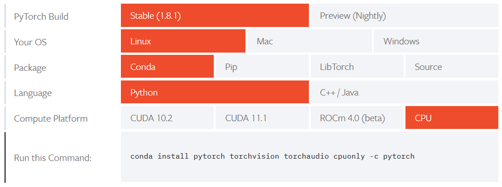

=============================
.. Installation

Kurulum 
=============================

.. Local installation

Yerel kurulum 
------------------

.. PyTorch is available for Windows, Linux, and macOS. It can be installed using package managers like ``Conda`` and ``Pip`` or it can be compiled directly from the source. The appropriate installation steps depend on the system, preferred installation method, available CUDA version, and programming language. The steps for each combination can be accessed on the website under the following link: `https://pytorch.org/get-started/locally/ <https://pytorch.org/get-started/locally/>`_

PyTorch, Windows, Linux ve macOS için mevcuttur. Conda ve pip gibi paket yöneticileri kullanılarak kurulabilir veya doğrudan kaynaktan derlenebilir. Uygun kurulum adımları sisteme, tercih edilen kurulum yöntemine, mevcut CUDA sürümüne ve programlama diline bağlıdır. Her kombinasyonun adımlarına web sitesinde şu bağlantıdan erişilebilir: `https://pytorch.org/get-started/locally/ <https://pytorch.org/get-started/locally/>`_ 

.. On this link, the following options can be found:

Bu bağlantıda aşağıdaki seçenekler bulunabilir: 

.. The first five columns are for the user to select the installation configuration, and the final column shows the command to be called to install the package. In this example above, we are installing PyTorch on a Linux system with no GPU support. We are using Conda and we want to install the Python interface. To do so, we open a terminal and execute the following command

İlk beş sütun, kullanıcının kurulum yapılandırmasını seçmesi içindir ve son sütun, paketi kurmak için çağrılacak komutu gösterir. Yukarıdaki örnekte, PyTorch'u GPU desteği olmayan bir Linux sistemine kuruyoruz. Conda kullanıyoruz ve Python arayüzünü kurmak istiyoruz. Bunu yapmak için bir terminal açıyoruz ve aşağıdaki komutu uyguluyoruz 

.. code-block:: bash

   conda install pytorch torchvision torchaudio cpuonly -c pytorch

.. TRUBA installation

TRUBA kurulumu 
------------------

.. We recommend installing PyTorch on TRUBA through the Conda virtual environment interface. It allows creating very customizable and easily modifiable Python environments.

PyTorch'u Conda sanal ortam arayüzü aracılığıyla TRUBA'ya kurmanızı öneririz. Çok özelleştirilebilir ve kolayca değiştirilebilir Python ortamları oluşturmaya izin verir. 

.. Installing Conda

Conda'yı yükleme 
^^^^^^^^^^^^^^^^

.. #. On the following webpage: `https://www.anaconda.com/products/individual <https://www.anaconda.com/products/individual>`_ go to the bottom of the page to the "Anaconda Installers" section and copy the link for the "64-Bit (x86) Installer".

#. Aşağıdaki web sayfasında: `https://www.anaconda.com/products/individual <https://www.anaconda.com/products/individual>`_ "Anaconda Installers" bölümüne sayfanın en altına git ve "64-Bit (x86) Installer" bağlantısını kopyalayın. 

#. TRUBA'da, yukarıda kopyalanan bağlantıyı kullanarak ``wget`` komutunu kullanarak yükleyici komut dosyasını indirin. 

   .. code-block:: bash

       wget https://repo.anaconda.com/archive/Anaconda3-<your_version>
#. Komut dosyası başarıyla indirildikten sonra, ``bash`` komutunu kullanarak onu çalıştırın: 

   .. code-block:: bash

       bash Anaconda3-<your_version>
#. Kurulumu tamamlamak için komut dizisindeki talimatları izleyin. 
#. Sen almak etkisine kurulum için kesmek ve tekrar bağlanma gerekecektir. 

.. #. On TRUBA, download the installer script using the ``wget`` command using the link copied above
.. #. After the script is downloaded successfully, run it using the ``bash`` command:
.. #. Follow the instructions of the script to complete the installation.

.. #. You will need to disconnect and reconnect for the installation to take effect.

.. Installing PyTorch

PyTorch'u Kurmak 
^^^^^^^^^^^^^^^^^^

#. (isteğe bağlı) yeni bir Conda ortamı oluşturun 

   #. Ortamı oluşturmak için aşağıdaki komutu yürütün 

      .. code-block:: bash

          conda create --name pyt_env

   #. Ortam oluşturulduktan sonra, aşağıdaki komutla etkinleştirin. 

      .. code-block:: bash

          conda activate pyt_env
#. Web sitesinden, PyTorch'u Conda kullanarak kurmak için uygun komutu kullanın. Bu öğreticiyi yazarken, CPU sürümünü yükleme komutu buydu: 

   .. code-block:: bash

       conda install pytorch torchvision torchaudio cpuonly -c pytorch

.. #. (optional) create a new Conda environment

..    #. Execute the following command to create the environment

..       .. code-block:: bash

..           conda create --name pyt_env

..    #. 
..       Once the environment is created, activate it with the following command

..       .. code-block:: bash

..           conda activate pyt_env

.. #. 
..    From the website, use the appropriate command for installing PyTorch using Conda. At the time of writing this tutorial, this was the command to install the CPU version:

..    .. code-block:: bash

..        conda install pytorch torchvision torchaudio cpuonly -c pytorch

.. Using PyTorch

PyTorch'u kullanma 
^^^^^^^^^^^^^^^^^^

.. If you installed PyTorch on TRUBA using Conda, then you must initialize Conda and load the environment on which PyTorch is installed at the beginning of your SLURM scripts. For example, this SLURM script will run the python script ``pyt_example.py`` that uses PyTorch:

PyTorch'u Conda kullanarak TRUBA'ya kurduysanız, o zaman Conda'yı başlatmanız ve SLURM komut dosyalarınızın başında PyTorch'un kurulu olduğu ortamı yüklemeniz gerekir. Örneğin, bu SLURM betiği, PyTorch kullanan pyt_example.py adlı python betiğini çalıştıracaktır. 

.. code-block:: bash

   #!/bin/bash
   #SBATCH --account=<account>
   #SBATCH --job-name=pyt_ex
   #SBATCH --ntasks=1
   #SBATCH --time=1-00:00:00

   # Setup environment
   module purge
   bash
   source /truba/home/<user_name>/anaconda3/bin/activate
   conda init
   conda activate pyt_env

   python pyt_example.py

.. This assumes that Conda was installed in the default location, and that the environment on which PyTorch is installed is named ``pyt_env``.

Bu, Conda'nın varsayılan konuma kurulduğunu ve PyTorch'un kurulu olduğu ortamın `` pyt_env '' olarak adlandırıldığını varsayar. 